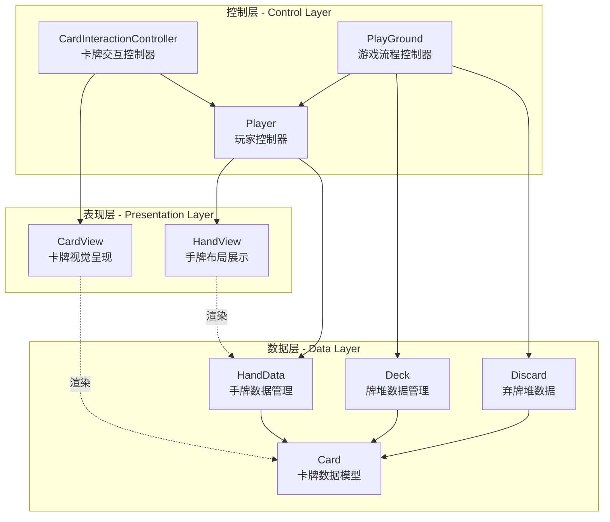
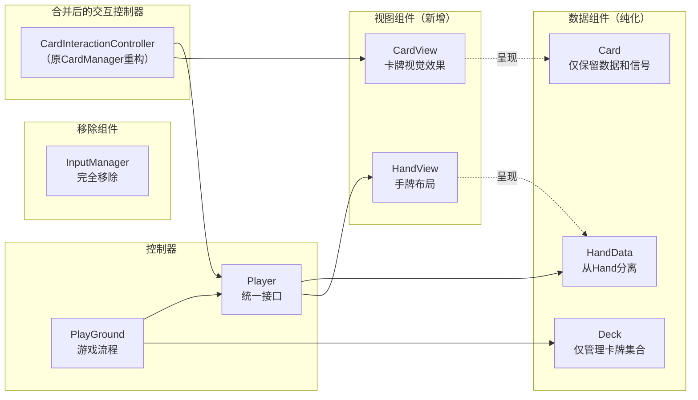
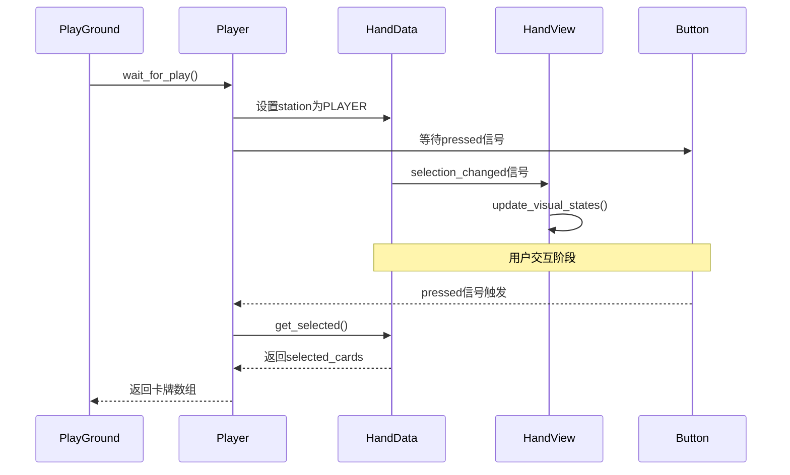
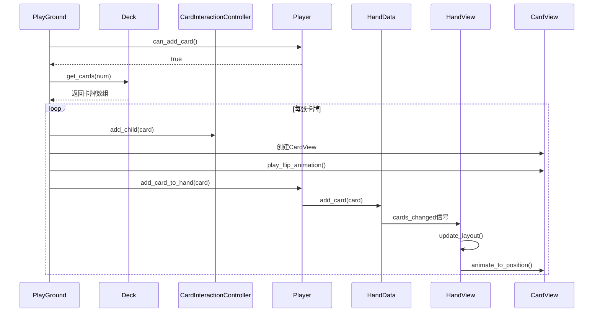
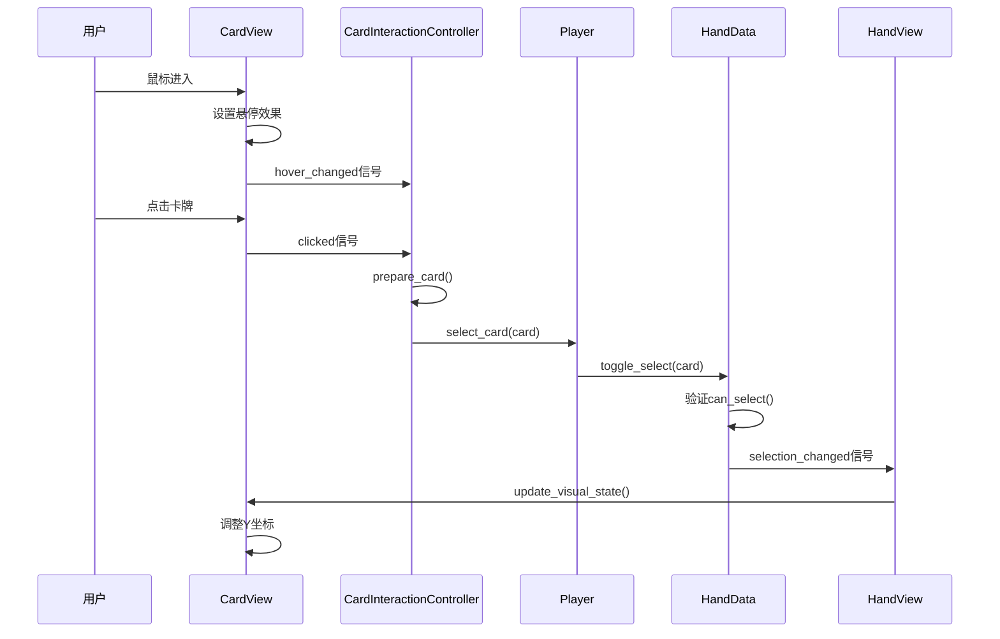
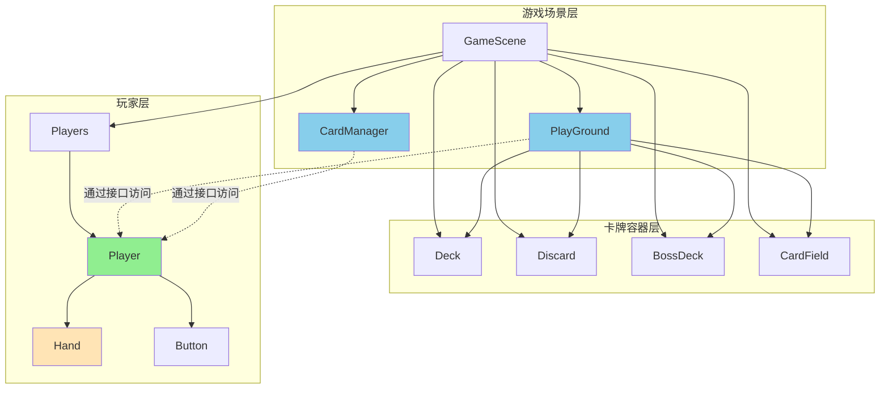

# 卡牌系统架构重构设计

## 设计目标

根据当前场景结构（Hand节点位于Player节点下），重新规划卡牌相关函数和管理器的职责边界与调用关系，使系统架构更符合场景层级设计，提高代码的内聚性与可维护性。

## 当前架构问题分析

### 场景层级结构

当前游戏场景采用以下层级结构：

```
GameScene
├── CardManager
├── Deck
├── Discard
├── BossDeck
├── CardField
├── PlayGround
├── InputManager
└── Players
    └── Player
        ├── Hand
        └── Button
```

### 交互层职责混乱分析

当前系统存在三个处理卡牌交互的组件，职责边界模糊：

| 组件 | 当前职责 | 存在问题 |
|------|---------|----------|
| InputManager | 监听全局输入事件（已注释） | 功能几乎完全废弃，但仍占用场景节点 |
| CardManager | 处理鼠标交互、碰撞检测、卡牌悬停、点击处理 | 职责过重，直接操作Hand和Deck |
| Card | 发送hover信号、处理鼠标进入/退出事件 | 与CardManager重复处理悬停逻辑 |
| Deck | 存储卡牌、抽牌逻辑、添加卡牌到Hand | 业务逻辑与交互逻辑混合 |
| Hand | UI布局、选中状态、用户交互、等待用户操作 | 数据管理与交互处理耦合 |

**具体问题表现：**

1. **InputManager冗余**
   - 文件位置：`scripts/input_manager.gd`
   - 问题：所有核心功能都被注释掉（第12-34行），只保留未使用的信号定义
   - 影响：占用场景节点，增加理解成本

2. **CardManager与Card的悬停逻辑重复**
   - CardManager：通过`_hover()`方法管理`card_hovering`状态（第34-46行）
   - Card：发送`hover`信号并在setter中修改scale和z_index（第5-13行）
   - 问题：悬停状态由两个组件分别维护，容易不一致

3. **CardManager职责过载**
   - 碰撞检测：`prepare_card()`方法（第48-57行）
   - 悬停管理：`_hover()`和`card_hovering`变量
   - 点击处理：`_input()`和`_drag()`方法
   - 卡牌连接：`connect_card()`方法
   - 问题：违反单一职责原则，难以扩展

4. **Deck的抽牌逻辑混乱**
   - 数据职责：管理`_cards`数组
   - 业务职责：判断手牌上限（第21、24行）
   - 交互职责：添加子节点到CardManager（第26行）
   - 视图职责：直接调用Hand.add_to_hand()（第27行）
   - 问题：跨越数据层、逻辑层、视图层的多层职责

5. **Hand的职责边界不清**
   - 数据管理：维护cards和selected_cards数组
   - UI渲染：计算位置、播放动画
   - 交互处理：处理卡牌选择逻辑
   - 异步控制：wait_for_user_play()和wait_for_user_discard()
   - 问题：MVC各层职责混合

### 核心问题识别

| 问题类型 | 具体表现 | 影响范围 |
|---------|---------|---------|
| 越级访问 | PlayGround、CardManager、Deck等组件直接通过路径`$"../Hand"`访问Hand节点 | 违反场景层级封装原则 |
| 职责混乱 | Hand同时承担UI布局、状态管理、用户交互等多重职责 | 高耦合、难以扩展 |
| 依赖错乱 | Deck、Discard、BossDeck等组件直接引用hand_ref和card_manager_ref | 循环依赖风险 |
| 接口缺失 | Player组件未提供完整的对外接口，外部组件绕过Player直接操作Hand | 封装性差 |

### 问题代码示例定位

**PlayGround中的越级访问：**
- 文件位置：`scripts/play_ground.gd`
- 问题代码：`@onready var player_hand: Hand = $"../Hand"`（第2行）
- 影响：直接访问Hand，未通过Player接口

**CardManager中的越级访问：**
- 文件位置：`scripts/card_manager.gd`
- 问题代码：`@onready var player_hand: Hand = $"../Hand"`（第6行）
- 影响：直接调用Hand的`select_card()`和`add_to_hand()`方法

**Deck中的不当引用：**
- 文件位置：`scripts/deck.gd`
- 问题代码：`@onready var hand_ref:Hand=$"../Hand"`（第6行）
- 影响：跨层级直接操作Hand的卡牌集合

**Discard中的不当引用：**
- 文件位置：`scripts/discard.gd`
- 问题代码：`@onready var hand_ref:Hand=$"../Hand"`（第6行）
- 影响：虽然声明但未使用，属于冗余依赖

**BossDeck中的不当引用：**
- 文件位置：`scripts/boss_deck.gd`
- 问题代码：`@onready var hand_ref: Hand = $"../Hand"`（第14行）
- 影响：虽然声明但未使用，属于冗余依赖

## 架构重构方案

### 设计原则

1. **场景层级一致性**：代码调用关系应与场景树层级保持一致
2. **接口隔离原则**：外部组件只能通过Player提供的公共接口访问Hand
3. **单一职责原则**：每个组件专注于单一核心职责
4. **依赖倒置原则**：高层模块不依赖低层模块，双方依赖抽象（信号机制）
5. **分层架构原则**：明确划分表现层、控制层、数据层

### 分层架构设计

系统采用三层架构模式，清晰划分各层职责：



**各层职责定义：**

| 层级 | 核心职责 | 禁止职责 |
|------|---------|----------|
| 表现层 | 视觉渲染、动画播放、UI布局 | 业务逻辑、数据持久化、输入处理 |
| 控制层 | 协调各层交互、处理用户输入、流程控制 | 直接操作数据、UI渲染细节 |
| 数据层 | 数据存储、数据验证、状态管理 | UI更新、用户交互、业务流程 |

### 精简交互组件方案

#### 方案概述

当前存在的交互相关组件：InputManager、CardManager、Card的交互部分、Deck的交互部分、Hand的交互部分。

**精简后的架构：**



**精简理由：**

1. **移除InputManager**
   - 当前功能已被完全注释，无实际作用
   - CardManager已直接使用`_input()`方法处理输入
   - 移除后减少无用节点和信号连接

2. **CardManager重构为CardInteractionController**
   - 专注于交互逻辑：碰撞检测、点击处理、交互转发
   - 移除悬停视觉效果管理（下放到CardView）
   - 移除直接操作Hand的代码（通过Player接口）

3. **Card分离为CardModel + CardView**
   - CardModel：纯数据（value、suit、rank、role、back状态）
   - CardView：视觉效果（scale、z_index、动画、遮罩）
   - 信号由CardView发出，数据由CardModel管理

4. **Hand分离为HandData + HandView**
   - HandData：卡牌数组管理、选中状态、验证逻辑
   - HandView：位置计算、布局算法、动画播放
   - 等待用户操作的逻辑移至Player

5. **Deck纯化为数据容器**
   - 仅管理_cards数组和基本操作（添加、移除、洗牌）
   - 抽牌逻辑移至PlayGround（业务层）
   - 手牌上限检查移至Player

#### Player（玩家控制器）

**重构后的统一接口层**

**核心职责：**
- 作为玩家相关功能的统一入口和协调者
- 对外提供手牌操作的标准接口
- 管理玩家的回合状态和信号通信
- 协调HandData和HandView的交互
- 处理异步用户操作（等待出牌、等待弃牌）

**对外接口设计：**

| 接口方法 | 功能说明 | 参数 | 返回值 |
|---------|---------|----|--------|
| add_card_to_hand(card) | 向手牌添加卡牌 | card: Card | 无 |
| wait_for_play() | 等待玩家出牌 | 无 | Array[Card] |
| wait_for_discard(target) | 等待玩家弃牌 | target: int | Array[Card] |
| remove_selected_cards() | 移除已选中的卡牌 | 无 | 无 |
| get_hand_card_count() | 获取手牌数量 | 无 | int |
| get_hand_card_sum() | 获取手牌点数总和 | 无 | int |
| select_card(card) | 选择指定卡牌 | card: Card | 无 |
| can_add_card() | 检查是否可添加卡牌 | 无 | bool |

**信号定义：**

| 信号名称 | 触发时机 | 参数 |
|---------|---------|----|
| cards_played | 玩家确认出牌后 | cards: Array[Card] |
| cards_discarded | 玩家确认弃牌后 | cards: Array[Card] |
| hand_changed | 手牌数量变化时 | card_count: int |

#### HandData（手牌数据管理器）

**核心职责：**
- 维护手牌卡牌集合（cards数组）
- 管理选中卡牌集合（selected_cards数组）
- 提供卡牌增删查改操作
- 执行卡牌有效性验证

**对外接口：**

| 方法名 | 功能 | 参数 | 返回值 |
|-------|------|------|--------|
| add_card(card) | 添加卡牌 | card: Card | void |
| remove_card(card) | 移除卡牌 | card: Card | void |
| toggle_select(card) | 切换选中状态 | card: Card | bool（是否选中） |
| get_selected() | 获取选中卡牌 | 无 | Array[Card] |
| clear_selected() | 清空选中 | 无 | void |
| remove_selected() | 移除选中卡牌 | 无 | Array[Card] |
| can_select(card) | 检查能否选中 | card: Card | bool |
| get_card_count() | 获取卡牌数量 | 无 | int |
| get_card_sum() | 获取卡牌点数和 | 无 | int |

**信号定义：**

| 信号名 | 触发时机 | 参数 |
|-------|---------|------|
| cards_changed | 卡牌数组变化 | cards: Array[Card] |
| selection_changed | 选中状态变化 | selected: Array[Card] |

**禁止职责：**
- UI布局计算
- 动画播放
- 按钮状态管理
- 用户输入处理

#### HandView（手牌视图渲染器）

**核心职责：**
- 监听HandData的数据变化
- 计算卡牌在手牌区的布局位置
- 播放卡牌移动动画
- 更新卡牌视觉状态（选中高度、禁用遮罩）

**内部方法：**

| 方法名 | 功能 | 触发时机 |
|-------|------|----------|
| update_layout() | 重新计算布局 | cards_changed信号 |
| update_visual_states() | 更新视觉状态 | selection_changed信号 |
| calc_card_position(index, total) | 计算单张卡牌位置 | update_layout()内部 |
| animate_to_position(card, pos) | 平滑移动卡牌 | update_layout()内部 |

**配置参数：**

| 参数名 | 类型 | 说明 |
|-------|------|------|
| hand_y_position | float | 手牌区Y坐标 |
| selected_y_offset | float | 选中卡牌的Y偏移 |
| screen_center_x | float | 屏幕中心X坐标 |

**禁止职责：**
- 管理卡牌数据
- 处理业务逻辑
- 直接响应用户输入

#### CardInteractionController（卡牌交互控制器）

**重构自CardManager，职责精简化**

**核心职责：**
- 处理全局鼠标输入事件（替代InputManager）
- 执行物理碰撞检测，识别点击目标
- 将交互事件转发给对应控制器

**职责边界：**

| 负责 | 不负责 |
|------|--------|
| 碰撞检测（prepare_card） | 悬停视觉效果 |
| 点击事件分发 | 卡牌选中逻辑 |
| 确定最高层级卡牌 | 手牌数据管理 |
| 区分卡牌角色（Hand/Deck/Boss） | 业务规则判断 |

**方法定义：**

```
方法名：_input(event)
功能：处理全局输入事件
参数：event (InputEvent)
逻辑：
  1. 检查是否为鼠标左键释放
  2. 调用prepare_card()获取点击的卡牌
  3. 根据卡牌role转发到对应处理器
```

```
方法名：prepare_card()
功能：检测鼠标位置的卡牌
返回值：Card或null
逻辑：
  1. 创建物理查询参数
  2. 使用碰撞掩码过滤
  3. 返回z_index最高的卡牌
```

```
方法名：handle_card_click(card)
功能：处理卡牌点击
参数：card (Card)
逻辑：
  根据card.role分发：
    - HAND角色 -> player.select_card(card)
    - DECK角色 -> 触发抽牌信号
    - BOSS角色 -> 触发Boss信息显示
    - DISCARD角色 -> 触发弃牌堆查看
```

**移除的职责：**
- ~~管理card_hovering状态~~（移至CardView）
- ~~connect_card()方法~~（改为CardView自行连接）
- ~~_hover()回调处理~~（移至CardView）
- ~~直接调用player_hand方法~~（改为通过Player接口）

**信号定义：**

| 信号名 | 触发时机 | 参数 |
|-------|---------|------|
| deck_clicked | 点击牌堆 | position: Vector2 |
| discard_clicked | 点击弃牌堆 | position: Vector2 |
| boss_clicked | 点击Boss牌 | boss: Card |

**依赖调整：**
- 移除：`@onready var player_hand: Hand`
- 移除：`@onready var input_manager: InputManager`（功能合并）
- 新增：`@export var player_path: NodePath`（指向Player节点）

#### Card（卡牌数据模型）

**重构后的纯数据模型**

**核心职责：**
- 存储卡牌的静态属性（value、suit、rank）
- 存储卡牌的状态属性（role、back、selected、disabled）
- 存储位置信息（hand_position）
- 提供静态工厂方法创建卡牌实例

**保留属性：**

| 属性名 | 类型 | 说明 |
|-------|------|------|
| value | int | 卡牌点数 |
| suit | CardData.Suit | 花色 |
| rank | String | 等级名称 |
| role | CardData.CardPosition | 当前位置角色 |
| back | bool | 是否显示背面 |
| selected | bool | 是否被选中 |
| disabled | bool | 是否被禁用 |
| hand_position | Vector2 | 目标手牌位置 |

**移除的视觉相关属性：**
- ~~hovered~~（移至CardView）
- ~~front_mask可见性控制~~（移至CardView）
- ~~scale控制~~（移至CardView）
- ~~z_index控制~~（移至CardView）

**保留方法：**
- `static func init_card_scene(...)`：创建普通卡牌
- `static func init_boss_scene(...)`：创建Boss卡牌

**移除方法：**
- ~~_on_area_2d_mouse_entered()~~（移至CardView）
- ~~_on_area_2d_mouse_exited()~~（移至CardView）
- ~~flip()动画~~（移至CardView）
- ~~_ready()中的connect_card~~（改为CardView处理）

**信号定义：**

| 信号名 | 触发时机 | 参数 |
|-------|---------|------|
| state_changed | 状态属性变化 | property: String, value: Variant |

#### CardView（卡牌视图组件）

**新增组件，负责卡牌的视觉呈现**

**核心职责：**
- 监听Card的状态变化
- 管理卡牌的视觉效果（悬停、选中、禁用）
- 处理鼠标交互区域检测
- 播放卡牌动画（翻转、移动）

**组件结构：**
```
CardView (Node2D)
├── Card (数据模型，脚本引用)
├── Sprite2D (正面)
├── Sprite2D (背面)
├── ColorRect (禁用遮罩)
├── Area2D (交互检测区域)
└── AnimationPlayer (动画播放器)
```

**视觉状态管理：**

| 状态 | 触发条件 | 视觉效果 |
|------|---------|----------|
| 悬停 | 鼠标进入Area2D | scale = HOVER_SCALE, z_index = 2 |
| 正常 | 鼠标离开 | scale = ORIGIN_SCALE, z_index = 1 |
| 选中 | card.selected = true | Y坐标上移 |
| 禁用 | card.disabled = true | 显示遮罩ColorRect |

**方法定义：**

```
方法名：_on_mouse_entered()
功能：处理鼠标进入
逻辑：
  1. 设置悬停视觉效果
  2. 发送hover_changed信号
```

```
方法名：_on_mouse_exited()
功能：处理鼠标离开
逻辑：
  1. 恢复正常视觉效果
  2. 发送hover_changed信号
```

```
方法名：play_flip_animation()
功能：播放翻转动画
逻辑：
  1. 播放翻转动画
  2. 动画中切换正/背面可见性
```

```
方法名：update_visual_state()
功能：根据Card状态更新视图
逻辑：
  1. 根据selected更新位置
  2. 根据disabled更新遮罩
  3. 根据back更新正/背面
```

**信号定义：**

| 信号名 | 触发时机 | 参数 |
|-------|---------|------|
| hover_changed | 悬停状态变化 | is_hovered: bool |
| clicked | 点击卡牌 | card: Card |

#### Deck、Discard、BossDeck（卡牌容器）

**纯化为数据容器**

**核心职责：**
- 管理各自的卡牌集合（_cards数组）
- 提供基础的卡牌操作（添加、移除、获取）
- 维护容器的可视化状态（empty/card_back节点）

**Deck精简后的接口：**

| 方法名 | 功能 | 参数 | 返回值 |
|-------|------|------|--------|
| get_cards(num) | 获取指定数量卡牌 | num: int | Array[Card] |
| put_card_top(card) | 放置卡牌到顶部 | card: Card | void |
| put_cards_back(cards) | 放回多张卡牌 | cards: Array[Card] | void |
| shuffle() | 洗牌 | 无 | void |
| is_empty() | 检查是否为空 | 无 | bool |
| get_count() | 获取卡牌数量 | 无 | int |

**移除的职责：**
- ~~draw_card()业务逻辑~~（移至PlayGround）
- ~~检查hand_ref.card_size~~（移至Player）
- ~~调用card_manager_ref.add_child()~~（移至PlayGround）
- ~~调用hand_ref.add_to_hand()~~（移至PlayGround通过Player）
- ~~播放翻转动画~~（移至PlayGround协调）
- ~~等待计时器~~（移至PlayGround）

**信号定义：**

| 信号名 | 触发时机 | 参数 |
|-------|---------|------|
| cards_changed | 卡牌数量变化 | count: int |
| became_empty | 牌堆变空 | 无 |

**依赖移除：**
- 移除所有对Hand和CardManager的直接引用
- 通过PlayGround中介协调卡牌流转
- 使用信号机制通知相关状态变化

#### PlayGround（游戏流程控制器）

**核心职责：**
- 协调各卡牌容器之间的卡牌流转
- 处理游戏回合逻辑和规则判定
- 作为各组件之间的通信中枢

**调用方式调整：**
- 原方式：`player_hand.wait_for_user_play()`
- 新方式：获取Player引用`$"../Players/Player"`，调用`player.wait_for_play()`

### 数据流重构设计

#### 出牌流程（重构后）



#### 抽牌流程（重构后）



#### 卡牌交互流程（重构后）



### 文件和组件迁移规划

#### 文件重命名和重构清单

| 原文件 | 新文件/操作 | 重构类型 |
|-------|------------|----------|
| input_manager.gd | 删除 | 完全移除 |
| input_manager.tscn | 删除 | 完全移除 |
| card_manager.gd | card_interaction_controller.gd | 重构+重命名 |
| card_manager.tscn | card_interaction_controller.tscn | 重命名 |
| card.gd | 保留，精简为数据模型 | 职责精简 |
| hand.gd | hand_data.gd + hand_view.gd | 分离为两个文件 |
| player.gd | 保留，增强接口 | 新增功能 |
| deck.gd | 保留，精简功能 | 职责精简 |
| discard.gd | 保留，清理依赖 | 清理凗余 |
| boss_deck.gd | 保留，清理依赖 | 清理凗余 |
| - | card_view.gd（新增） | 新建文件 |

#### 新增card_view.gd 设计

**文件路径：**`scripts/card_view.gd`

**组件结构设计：**

方式一：作为Card的子类（推荐）
```
class_name CardView extends Card

功能：
- 继承Card的所有数据属性
- 添加视觉效果管理逻辑
- 处理Area2D交互事件
优点：
- 无需修改现有Card创建逻辑
- 保持向后兼容
缺点：
- Card内部仍有视觉逻辑残留
```

方式二：Card与CardView完全分离
```
class_name CardView extends Node2D

属性：
- card_model: Card （引用）

功能：
- 监听card_model.state_changed信号
- 更新视觉状态

优点：
- 分离彻底，MVC清晰
缺点：
- 需要大量重构现有代码
```

**采用方案：**方式一（分阶段重构，降低风险）

**核心方法定义：**

```
方法名：_on_area_mouse_entered()
计划：从Card迁移到CardView
功能：设置悬停视觉效果
实现：
  self.scale = CardData.HOVER_SCALE
  self.z_index = 2
  emit_signal("hover_changed", true)
```

```
方法名：_on_area_mouse_exited()
计划：从Card迁移到CardView
功能：恢复正常视觉效果
实现：
  self.scale = CardData.ORIGIN_SCALE
  self.z_index = 1
  emit_signal("hover_changed", false)
```

```
方法名：update_visual_from_state()
计划：新增
功能：根据数据状态更新视图
参数：property_name: String
实现：
  match property_name:
    "selected":
      # 更新Y坐标
    "disabled":
      front_mask.visible = disabled
    "back":
      $back.visible = back
      $front.visible = !back
```

#### 新增hand_data.gd 设计

**文件路径：**`scripts/hand_data.gd`

**从hand.gd中迁移的功能：**

| 功能 | 原位置 | 迁移后位置 |
|------|---------|------------|
| cards数组 | hand.gd | hand_data.gd |
| selected_cards数组 | hand.gd | hand_data.gd |
| discard_target | hand.gd | hand_data.gd |
| station | hand.gd | hand_data.gd |
| add_to_hand() | hand.gd | hand_data.add_card() |
| remove_from_hand() | hand.gd | hand_data.remove_card() |
| select_card() | hand.gd（逻辑部分） | hand_data.toggle_select() |
| remove_selected() | hand.gd | hand_data.remove_selected() |
| get_selected() | hand.gd | hand_data.get_selected() |
| card_size | hand.gd | hand_data.get_card_count() |
| card_sum | hand.gd | hand_data.get_card_sum() |

**信号定义：**

```
signal cards_changed(cards: Array[Card])
signal selection_changed(selected: Array[Card])
signal station_changed(station: CardData.TurnStation)
```

#### 新增hand_view.gd 设计

**文件路径：**`scripts/hand_view.gd`

**从hand.gd中迁移的功能：**

| 功能 | 原位置 | 迁移后位置 |
|------|---------|------------|
| HAND_Y | hand.gd | hand_view.gd |
| SELECTED_Y | hand.gd | hand_view.gd |
| screen_center_x | hand.gd | hand_view.gd |
| update_position() | hand.gd | hand_view.update_layout() |
| calc_pos() | hand.gd | hand_view.calc_card_position() |
| select_card()（UI部分） | hand.gd | hand_view.update_visual_states() |

**依赖引用：**

```
@onready var hand_data: HandData = $HandData
@export var card_width: float = CardData.CARD_WIDTH
@export var selected_y_offset: float = CardData.CARD_LENGTH / 5
```

**核心方法：**

```
方法名：update_layout()
功能：重新计算所有卡牌位置
触发：hand_data.cards_changed信号
逻辑：
  var cards = hand_data.cards
  var size = cards.size()
  for i in range(size):
    var pos = calc_card_position(i, size, cards[i].selected)
    animate_card_to(cards[i], pos)
```

```
方法名：calc_card_position(index, total, is_selected)
功能：计算单张卡牌位置
返回：Vector2
逻辑：
  var x = screen_center_x + index * card_width - (total - 1) * card_width / 2
  var y = hand_y_position if not is_selected else hand_y_position - selected_y_offset
  return Vector2(x, y)
```

#### Player.gd 需要添加的接口

**手牌操作接口：**

```
功能：添加卡牌到手牌
方法名：add_card_to_hand
参数：card (Card类型)
实现逻辑：调用hand.add_to_hand(card)
```

```
功能：等待玩家出牌
方法名：wait_for_play
返回值：Array[Card]
实现逻辑：
  1. 调用hand.wait_for_user_play()
  2. 获取选中的卡牌数组
  3. 返回卡牌数组
```

```
功能：等待玩家弃牌
方法名：wait_for_discard
参数：target (int类型，目标弃牌点数)
返回值：Array[Card]
实现逻辑：调用hand.wait_for_user_discard(target)
```

```
功能：移除已选中的卡牌
方法名：remove_selected_cards
实现逻辑：调用hand.remove_selected()
```

**手牌状态查询接口：**

```
功能：获取手牌数量
方法名：get_hand_card_count
返回值：int
实现逻辑：返回hand.card_size
```

```
功能：获取手牌点数总和
方法名：get_hand_card_sum
返回值：int
实现逻辑：返回hand.card_sum
```

**卡牌选择接口：**

```
功能：选择指定卡牌
方法名：select_card
参数：card (Card类型)
实现逻辑：调用hand.select_card(card)
```

#### CardInteractionController.gd 重构指南

**文件重命名：**`card_manager.gd` -> `card_interaction_controller.gd`

**类名修改：**`class_name CardManager` -> `class_name CardInteractionController`

**移除内容：**

| 行号 | 内容 | 移除原因 |
|-----|------|----------|
| 4 | var card_hovering: Card | 悬停状态由CardView管理 |
| 31-46 | connect_card()和_hover()方法 | 移至CardView |
| 25 | input_manager引用 | InputManager已删除 |

**修改内容：**

| 原代码 | 新代码 |
|-------|-------|
| @onready var player_hand: Hand = $"../Hand" | @export var player_path: NodePath<br/>@onready var player: Player = get_node(player_path) |
| player_hand.select_card(card) | player.select_card(card) |
| player_hand.add_to_hand(card) | player.add_card_to_hand(card) |

**新增方法：**

```
方法名：handle_card_click(card: Card)
功能：统一处理卡牌点击
逻辑：
  match card.role:
    CardData.CardPosition.HAND:
      player.select_card(card)
    CardData.CardPosition.DECK:
      emit_signal("deck_clicked", card.position)
    CardData.CardPosition.BOSS:
      emit_signal("boss_clicked", card)
    CardData.CardPosition.DISCARD:
      emit_signal("discard_clicked", card.position)
```

#### PlayGround.gd 需要修改的部分

**依赖引用调整：**

| 原引用 | 新引用 | 节点路径 |
|-------|-------|---------|
| player_hand: Hand | player: Player | $"../Players/Player" |

**方法调用调整：**

| 方法位置 | 原调用 | 新调用 |
|---------|-------|--------|
| take_turns()第15行 | player_hand.wait_for_user_play() | player.wait_for_play() |
| boss_attack()第66行 | player_hand.card_sum | player.get_hand_card_sum() |
| boss_attack()第69行 | player_hand.wait_for_user_discard(...) | player.wait_for_discard(...) |
| boss_attack()第70行 | player_hand.remove_selected() | player.remove_selected_cards() |

#### Deck.gd 需要修改的部分

**依赖清理：**

| 行号 | 需要删除的引用 |
|-----|--------------|
| 第6行 | @onready var hand_ref:Hand=$"../Hand" |

**方法调用调整：**

| 方法位置 | 原调用 | 新调用方式 |
|---------|-------|----------|
| draw_card()第21行 | hand_ref.card_size | 改为通过参数传入或信号通知 |
| draw_card()第24行 | hand_ref.card_size | 改为通过参数传入或信号通知 |
| draw_card()第27行 | hand_ref.add_to_hand(card) | 通过PlayGround调用Player接口 |

**重构方案：**

方案一（推荐）：由PlayGround负责协调
- Deck的draw_card()方法改为仅返回卡牌数组，不直接添加到手牌
- PlayGround调用Deck.draw_card()获取卡牌，再调用Player.add_card_to_hand()

方案二：使用信号机制
- Deck定义信号`card_drawn(card: Card)`
- PlayGround连接该信号，在回调中调用Player.add_card_to_hand()

#### Discard.gd 需要修改的部分

**依赖清理：**

| 行号 | 需要删除的引用 |
|-----|--------------|
| 第6行 | @onready var hand_ref:Hand=$"../Hand" |
| 第7行 | @onready var card_manager_ref:CardManager=$"../CardManager" |

**说明：** 这些引用在当前代码中未被使用，可直接删除。

#### BossDeck.gd 需要修改的部分

**依赖清理：**

| 行号 | 需要删除的引用 |
|-----|--------------|
| 第14行 | @onready var hand_ref: Hand = $"../Hand" |

**说明：** 该引用在当前代码中未被使用，可直接删除。

### 关键技术决策

#### 决策1：Player节点的定位方式

**背景：** CardManager、PlayGround等组件需要获取Player节点引用

**选项对比：**

| 方案 | 路径示例 | 优点 | 缺点 |
|-----|---------|-----|-----|
| 相对路径 | $"../Players/Player" | 简单直接 | 场景结构变化时易失效 |
| NodePath导出 | @export var player_path: NodePath | 灵活可配置 | 增加编辑器配置复杂度 |
| 单例模式 | GameManager.get_player() | 全局访问 | 引入全局状态 |
| 信号总线 | EventBus发送请求 | 解耦性强 | 增加调试难度 |

**推荐方案：** 使用@export导出NodePath，在场景编辑器中配置
- 理由：平衡了灵活性和可维护性，便于多玩家扩展

#### 决策2：Deck抽牌逻辑的重构方式

**背景：** Deck当前直接操作Hand，需要解除耦合

**选项对比：**

| 方案 | 实现方式 | 优点 | 缺点 |
|-----|---------|-----|-----|
| 返回值方式 | draw_card()返回卡牌数组 | 简单清晰 | PlayGround需要手动添加到Hand |
| 信号通知 | 发送card_drawn信号 | 解耦彻底 | 增加信号连接复杂度 |
| 回调函数 | 接受回调参数处理卡牌 | 灵活性高 | GDScript不推荐此模式 |

**推荐方案：** 返回值方式
- 理由：符合Godot最佳实践，代码流程清晰易懂

#### 决策3：手牌数量限制的检查位置

**背景：** 当前Deck.draw_card()内部检查hand_ref.card_size

**选项对比：**

| 方案 | 检查位置 | 优点 | 缺点 |
|-----|---------|-----|-----|
| 在Deck内部 | Deck.draw_card() | 防止过度抽牌 | Deck依赖Hand状态 |
| 在PlayGround | 调用前检查 | Deck职责单一 | 调用方需要记得检查 |
| 在Player | Player.can_add_card() | 符合封装原则 | 需要额外接口 |

**推荐方案：** 在Player提供can_add_card()接口，PlayGround调用前检查
- 理由：保持职责分离，便于未来扩展（如装备加手牌上限）

### 迁移后的组件关系图



**关系说明：**
- 实线箭头：场景树父子关系
- 虚线箭头：代码调用关系
- 绿色高亮：核心接口层（Player）
- 橙色高亮：内部实现层（Hand）
- 蓝色高亮：协调控制层（PlayGround、CardManager）

## 重构实施步骤

### 阶段1：基础架构准备（0.5-1天）

**目标：**创建新的文件结构，建立基础接口

**任务清单：**

1. **创建hand_data.gd**
   - 从 hand.gd 复制所有数据相关属性
   - 实现 add_card()、remove_card()、toggle_select() 方法
   - 定义 cards_changed 和 selection_changed 信号
   - 实现 get_card_count() 和 get_card_sum() 方法

2. **创建hand_view.gd**
   - 从 hand.gd 复制所有UI相关方法
   - 实现 update_layout() 方法
   - 实现 calc_card_position() 方法
   - 连接 hand_data 的信号

3. **修改player.tscn场景结构**
   - 在Player节点下添加HandData节点
   - 将原Hand节点重命名为HandView
   - 配置HandView的hand_data引用

4. **增强Player.gd接口**
   - 添加 add_card_to_hand(card) 方法
   - 添加 wait_for_play() 方法
   - 添加 wait_for_discard(target) 方法
   - 添加 remove_selected_cards() 方法
   - 添加 get_hand_card_count() 和 get_hand_card_sum() 方法
   - 添加 select_card(card) 方法
   - 添加 can_add_card() 方法

**验证标准：**
- hand_data.gd 和 hand_view.gd 文件创建成功
- Player接口可以正常调用且不报错
- 场景节点结构正确
- 保留原hand.gd作为备份

### 阶段2：PlayGround和CardManager调用者重构（1-1.5天）

**目标：**将所有直接访问Hand的代码改为访问Player接口

**任务清单：**

1. **重构PlayGround.gd**
   - 修改 player_hand 引用为 player 引用
   - 更新节点路径为 `$"../Players/Player"`
   - 修改 take_turns() 中的调用
   - 修改 boss_attack() 中的调用
   - 修改所有直接访问 hand 的地方

2. **重构CardManager.gd**
   - 文件重命名为 card_interaction_controller.gd
   - 修改类名为 CardInteractionController
   - 修改 player_hand 引用为 player 引用
   - 移除 card_hovering 相关逻辑
   - 移除 connect_card() 和 _hover() 方法
   - 修改 _drag() 方法中的调用
   - 移除 input_manager 引用

3. **更新game_scene.tscn**
   - 修改CardManager节点的引用
   - 配置CardInteractionController的player_path属性

4. **删除InputManager**
   - 删除 input_manager.gd 文件
   - 删除 input_manager.tscn 文件
   - 从 game_scene.tscn 移除InputManager节点

**验证标准：**
- 游戏可以正常运行
- 出牌功能正常
- 抽牌功能正常
- 卡牌选择功能正常
- 无直接访问Hand的代码

### 阶段3：Deck系列组件精简（0.5-1天）

**目标：**将Deck、Discard、BossDeck精简为纯数据容器

**任务清单：**

1. **重构Deck.gd**
   - 移除 hand_ref 和 card_manager_ref 引用
   - 将 draw_card() 方法改为 get_cards(num) 方法
   - get_cards() 只返回卡牌数组，不执行添加操作
   - 保留 put_boss_top() 和 put_cards_back() 方法
   - 添加 is_empty() 和 get_count() 方法
   - 定义 cards_changed 和 became_empty 信号

2. **重构Discard.gd**
   - 移除 hand_ref 和 card_manager_ref 引用
   - 保留 getCards() 和 fresh_pos() 方法

3. **重构BossDeck.gd**
   - 移除 hand_ref 引用
   - 保留 card_manager_ref（用于add_child）

4. **调整PlayGround的抽牌逻辑**
   - 创建 draw_cards_to_hand(num) 方法
   - 实现循环调用 Deck.get_cards() 和 Player.add_card_to_hand()
   - 实现翻转动画和延迟逻辑
   - 更新 _start() 方法中的调用

**验证标准：**
- 抽牌功能正常
- 卡牌动画正常
- Boss抽牌正常
- 弃牌堆功能正常

### 阶段4：视图层分离（可选，1-2天）

**目标：**将Card的视觉逻辑分离到CardView

**任务清单：**

1. **创建CardView类**
   - 创建card_view.gd，继承自Card
   - 迁移 hovered setter 逻辑
   - 迁移 _on_area_2d_mouse_entered/exited 方法
   - 添加 update_visual_from_state() 方法

2. **精简Card类**
   - 移除 hovered 属性和setter
   - 保留 selected、disabled、back 属性
   - 保留静态工厂方法
   - 添加 state_changed 信号

3. **更新卡牌创建逻辑**
   - 修改 init_card_scene() 返回 CardView
   - 修改 init_boss_scene() 返回 CardView

4. **更新CardInteractionController**
   - 移除所有 connect_card() 调用
   - CardView 自动处理悬停效果

**验证标准：**
- 卡牌悬停效果正常
- 卡牌选中效果正常
- 卡牌禁用效果正常
- 卡牌翻转动画正常

### 阶段5：测试和优化（1-1.5天）

**目标：**确保重构后游戏功能完整且无bug

**任务清单：**

1. **功能测试**
   - 测试完整游戏流程
   - 测试所有边界情况
   - 测试卡牌交互
   - 测试Boss战斗

2. **性能优化**
   - 检查帧率
   - 优化信号连接
   - 优化布局计算

3. **代码清理**
   - 删除所有注释的旧代码
   - 添加必要的注释
   - 统一命名风格

4. **文档更新**
   - 更新API文档
   - 更新架构图
   - 编写重构说明

**验证标准：**
- 所有功能测试通过
- 帧率稳定在60fps
- 无警告和错误信息
- 代码符合规范

## 潜在风险和应对措施

### 风险1：分层架构的复杂度

**风险描述：**将Hand分离为HandData和HandView增加了架构复杂度，可能导致信号连接和数据同步问题

**影响范围：**手牌系统的所有功能

**应对措施：**
- 短期：在_ready()中使用assert验证信号连接
- 中期：编写详细的单元测试，验证数据流
- 长期：考虑引入事件总线或状态管理框架

**监控指标：**
- 启动时检查所有信号是否正确连接
- 记录cards_changed和selection_changed信号触发次数
- 监控HandView的update_layout()调用频率

**降级方案：**
如果分层架构问题过多，可以保留原始Hand结构，仅执行Player接口封装

### 风险2：节点路径引用失效

**风险描述：**使用相对路径`$"../Players/Player"`在场景结构调整时可能失效

**影响范围：**CardInteractionController、PlayGround等组件无法获取Player引用

**应对措施：**
- 短期：使用@export导出NodePath，在编辑器中配置
- 中期：在_ready()中检查player引用是否为null，失败时push_error
- 长期：考虑引入场景服务定位器模式或依赖注入

**监控指标：**
- 启动时检查所有@onready引用是否为null
- 添加assert确俚Player引用有效

**预防措施：**
```gdscript
@export var player_path: NodePath = "../Players/Player"
@onready var player: Player = get_node(player_path)

func _ready():
    assert(player != null, "Player reference is null! Check player_path in inspector.")
```

### 风险3：CardView创建的性能影响

**风险描述：**如果采用分离架构，每张卡牌需要创建Card+CardView两个实例，可能影响性能

**影响范围：**卡牌创建和抽牌流程

**应对措施：**
- 推荐方案：CardView继承自Card，避免双实例
- 备选方案：使用对象池复用CardView实例
- 性能测试：在创建52张卡牌后测量帧率

**监控指标：**
- 帧率监控：目标维持60fps
- 内存使用：监控卡牌实例数量

### 风险4：InputManager删除引发的级联问题

**风险描述：**删除InputManager后，其他组件如果有引用会导致错误

**影响范围：**所有引用InputManager的组件

**应对措施：**
- 删除前全局搜索"InputManager"关键词
- 检查所有.tscn文件中的引用
- 检查所有.gd文件中的import和引用

**验证方法：**
- 在Godot编辑器中搜索"InputManager"
- 检查是否有其他位置使用
- 删除后运行游戏，检查是否有错误日志

### 风险5：多玩家扩展兼容性

**风险描述：**当前设计假设单玩家，未来多玩家时可能需要调整

**影响范围：**Player引用获取方式、PlayGround协调逻辑

**应对措施：**
- 预留Players管理器扩展接口
- PlayGround使用数组管理多个Player引用
- 使用策略模式处理不同玩家数量的逻辑

**预留设计：**
```gdscript
# PlayGround.gd
@export var player_paths: Array[NodePath]  # 支持多玩家
var players: Array[Player] = []

func _ready():
    for path in player_paths:
        players.append(get_node(path))
```

**监控指标：**
- 代码耦合度分析
- 可扩展性评估

### 风险6：信号爆炸（Signal Explosion）

**风险描述：**分层架构引入大量信号，可能导致调试困难和性能下降

**影响范围：**HandData、HandView、CardView之间的通信

**应对措施：**
- 合并相似信号，减少信号数量
- 使用事件参数传递更多信息
- 关键路径考虑直接调用代替信号

**优化示例：**
```gdscript
# 不推荐：多个细粒度信号
signal card_added
signal card_removed
signal card_selected
signal card_deselected

# 推荐：合并为单一信号
signal cards_changed(operation: String, cards: Array[Card])
```

**监控指标：**
- 信号连接数量
- 信号触发频率

## 设计验收标准

### 架构层面

| 标准项 | 验收条件 |
|-------|---------|
| 层级一致性 | 所有代码调用关系符合场景树层级，无越级访问 |
| 接口完整性 | Player提供的接口覆盖所有Hand功能需求 |
| 依赖清晰性 | 所有组件的依赖关系明确且单向，无循环依赖 |
| 职责单一性 | 每个组件职责明确，无功能重叠 |

### 功能层面

| 标准项 | 验收条件 |
|-------|---------|
| 功能完整性 | 所有原有功能正常工作 |
| 交互流畅性 | 用户交互无延迟或卡顿 |
| 逻辑正确性 | 游戏规则判定准确无误 |
| 异常处理 | 边界情况处理正确（如手牌满、牌堆空等） |

### 代码层面

| 标准项 | 验收条件 |
|-------|---------|
| 可读性 | 代码结构清晰，命名规范 |
| 可维护性 | 新增功能或修改无需大范围改动 |
| 可测试性 | 关键逻辑可单独测试 |
| 文档完整性 | 重要接口和方法有清晰注释 |

## 后续优化方向

### 短期优化（重构完成后）

1. **添加接口文档注释**
   - 为Player的所有公共接口添加详细的GDScript文档注释
   - 说明参数类型、返回值、使用场景

2. **引入类型提示**
   - 所有方法参数和返回值使用类型标注
   - 提高代码可读性和IDE支持

3. **错误处理增强**
   - 在接口方法中添加参数有效性检查
   - 异常情况输出警告或错误日志

### 中期优化（1-2个迭代周期）

1. **信号机制优化**
   - 评估关键流程是否适合使用信号
   - 减少轮询和等待式代码

2. **状态机引入**
   - 为Hand和Player引入状态机管理回合状态
   - 替代当前的station枚举方式

3. **配置数据外置**
   - 将CardData中的常量抽取为资源文件
   - 便于策划调整数值

### 长期优化（版本迭代）

1. **多玩家支持**
   - Players管理器实现多玩家协调
   - PlayGround支持多玩家回合切换

2. **网络同步**
   - 为Player接口添加网络同步支持
   - 实现卡牌操作的网络传输

3. **UI框架解耦**
   - 将Hand的UI逻辑抽取为独立的View层
   - Player作为ViewModel层协调数据和视图

4. **单元测试覆盖**
   - 为所有接口方法编写单元测试
   - 引入GUT测试框架

## 附录：关键接口规范

### Player接口规范

**接口分类：**

**手牌操作类：**
- `add_card_to_hand(card: Card) -> void`
- `remove_selected_cards() -> void`

**异步交互类：**
- `wait_for_play() -> Array[Card]`
- `wait_for_discard(target: int) -> Array[Card]`

**状态查询类：**
- `get_hand_card_count() -> int`
- `get_hand_card_sum() -> int`
- `can_add_card() -> bool`

**交互控制类：**
- `select_card(card: Card) -> void`

**调用约定：**
- 所有异步方法使用await调用
- 所有参数进行非空检查
- 返回的数组使用duplicate()避免外部修改

### Hand内部方法约定

**访问控制：**
- 所有public方法仅供Player调用
- 不对外暴露cards和selected_cards数组的引用
- update_position()等内部方法保持private语义

**状态管理：**
- station状态由Player通过接口控制
- 禁止外部直接设置station属性

**信号发送：**
- Hand不直接发送游戏逻辑信号
- 所有信号由Player转发

