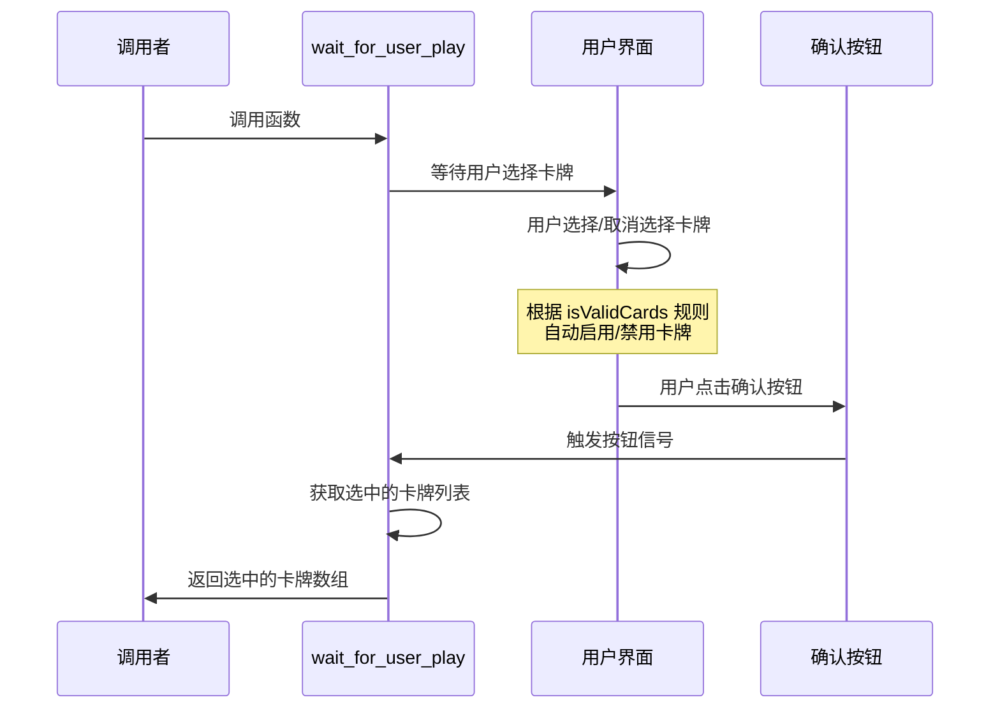
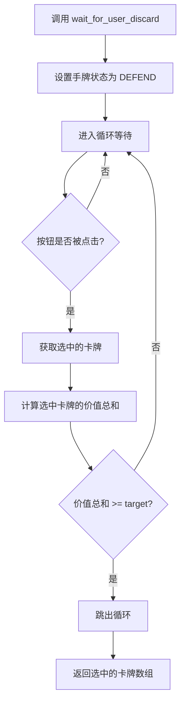
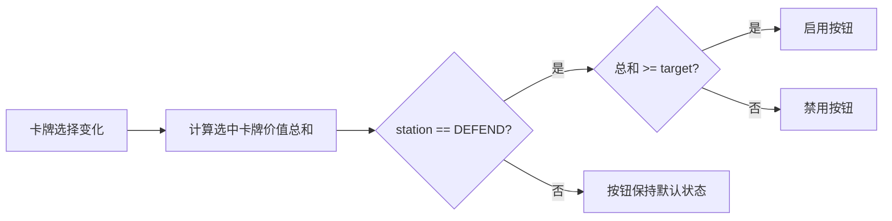

# Hand.gd 用户操作等待函数设计

## 设计概述

在 Hand 类中新增两个异步等待函数，用于处理用户的卡牌操作交互。这两个函数将暂停执行流程，直到用户完成特定的卡牌选择并确认操作。

## 功能需求

### 功能 1：等待用户出牌

**函数名称**：`wait_for_user_play`

**功能描述**：
等待用户根据出牌规则选择合法的卡牌组合并点击按钮确认出牌。函数将持续等待，直到用户完成选择并点击确认按钮。

**返回值**：
- 类型：Array[Card]
- 内容：用户选中并确认打出的所有卡牌

**行为流程**：

**核心逻辑**：
1. 函数开始时，设置手牌状态为 PLAYER 阶段
2. 等待确认按钮的 pressed 信号
3. 信号触发后，获取当前选中的所有卡牌
4. 返回选中的卡牌数组

**前置条件**：
- Hand 对象需要引用到场景中的确认按钮节点
- 卡牌选择规则（isValidCards）已正确实现
- selected_cards 数组实时反映用户的选择状态

**依赖关系**：
- 依赖现有的 `select_card()` 方法处理卡牌选择
- 依赖现有的 `get_selected()` 方法获取选中卡牌
- 依赖现有的 `station` 属性控制交互阶段
- 依赖按钮节点的 pressed 信号

---

### 功能 2：等待用户弃牌

**函数名称**：`wait_for_user_discard`

**入参**：
- 参数名：`target`
- 类型：int
- 说明：用户必须选择的卡牌价值总和的最小值

**功能描述**：
等待用户选择价值总和不小于 target 的卡牌并点击按钮确认。如果用户选择的卡牌价值总和小于 target，确认按钮将保持禁用状态，无法点击。函数将持续等待，直到用户选择满足条件的卡牌并确认。

**返回值**：
- 类型：Array[Card]
- 内容：用户选中并确认弃掉的所有卡牌

**行为流程**：

**核心逻辑**：
1. 函数开始时，设置手牌状态为 DEFEND 阶段
2. 进入循环，等待确认按钮的 pressed 信号
3. 按钮被点击后，获取当前选中的卡牌
4. 计算选中卡牌的价值总和
5. 如果总和不小于 target，跳出循环；否则继续等待
6. 返回满足条件的卡牌数组

**按钮状态控制逻辑**：

为确保按钮在选中卡牌价值不足时无法点击，需要实现以下机制：

| 条件 | 按钮状态 |
|------|---------|
| 选中卡牌价值总和 < target | 禁用（disabled = true） |
| 选中卡牌价值总和 >= target | 启用（disabled = false） |

**状态更新触发时机**：
- 每次卡牌被选中或取消选中时
- 通过监听 selected_cards 的变化或在 select_card 方法中触发

**前置条件**：
- Hand 对象需要引用到场景中的确认按钮节点
- 调用者已确保所有手牌的价值总和不小于 target（不会出现无解情况）
- CardData.sum 函数可用于计算卡牌价值总和

**依赖关系**：
- 依赖现有的 `select_card()` 方法处理卡牌选择
- 依赖现有的 `get_selected()` 方法获取选中卡牌
- 依赖现有的 `station` 属性控制交互阶段
- 依赖 `CardData.sum` 函数计算价值总和
- 依赖按钮节点的 pressed 信号及 disabled 属性

**与现有代码的对比**：

参考 play_ground.gd 中第 69-80 行的 boss_attack 方法，该方法已实现类似的等待逻辑：
- 使用 await 等待按钮信号
- 使用 while 循环确保条件满足
- 使用 cards.reduce(CardData.sum, 0) 计算价值总和

本设计将此逻辑封装到 Hand 类中，使其成为可复用的方法。

---

## 数据结构

### 按钮节点引用

Hand 类需要新增对确认按钮的引用：

| 属性名 | 类型 | 说明 |
|--------|------|------|
| confirm_button | Button | 场景中的确认按钮节点引用 |

**获取方式**：
- 使用 @onready 注解和节点路径获取
- 或通过外部注入方式设置

---

## 交互状态管理

### TurnStation 状态说明

| 状态 | 使用场景 | 卡牌选择规则 |
|------|----------|-------------|
| PLAYER | wait_for_user_play | 根据 isValidCards 规则限制卡牌选择 |
| DEFEND | wait_for_user_discard | 允许自由选择任意卡牌 |

**状态切换时机**：
- wait_for_user_play 开始时，设置为 PLAYER
- wait_for_user_discard 开始时，设置为 DEFEND

---

## 按钮控制策略

### wait_for_user_play 的按钮控制

**方案**：不需要额外的按钮禁用逻辑

**理由**：
- 出牌阶段由用户主动决定何时出牌
- 即使选择不合法的组合，也可以通过 isValidCards 在卡牌级别进行限制
- 用户可以选择不出牌或出合法的牌

### wait_for_user_discard 的按钮控制

**方案**：动态控制按钮的 disabled 属性

**实现策略**：
1. 在 select_card 方法或 update_position 方法中添加按钮状态检查逻辑
2. 每次选中卡牌变化时，计算选中卡牌的价值总和
3. 根据总和与 target 的比较结果，设置按钮的 disabled 属性

**状态判断逻辑**：

**需要新增的属性**：

| 属性名 | 类型 | 默认值 | 说明 |
|--------|------|--------|------|
| discard_target | int | 0 | wait_for_user_discard 的目标值 |

**更新时机**：
- wait_for_user_discard 开始时，设置 discard_target 为传入的 target 值
- 每次 select_card 被调用后，检查并更新按钮状态
- wait_for_user_discard 结束时，重置 discard_target 为 0

---

## 异步控制流

### 等待机制说明

两个函数都使用 Godot 的 await 关键字实现异步等待：

**await 的作用**：
- 暂停当前函数的执行
- 等待指定的信号被触发
- 信号触发后恢复函数执行

**信号来源**：
- 确认按钮的 pressed 信号

### 循环等待模式

wait_for_user_discard 使用 while 循环确保条件满足：

**循环结构**：
1. 循环条件：卡牌价值总和小于 target
2. 循环体：等待按钮点击信号
3. 退出条件：价值总和不小于 target

**与 wait_for_user_play 的区别**：
- wait_for_user_play：单次等待，无条件检查
- wait_for_user_discard：循环等待，带条件检查

---

## 与现有系统的集成

### 对现有代码的修改需求

**Hand 类需要新增的内容**：
1. confirm_button 节点引用
2. discard_target 属性
3. wait_for_user_play 方法
4. wait_for_user_discard 方法
5. 按钮状态更新逻辑（在 select_card 或 update_position 中）

**不需要修改的现有功能**：
- select_card 方法的核心逻辑
- get_selected 方法
- update_position 的位置计算逻辑
- station 属性的 setter

### 调用示例场景

**场景 1：玩家回合出牌**

调用者调用 wait_for_user_play，等待用户选择并打出卡牌，然后处理卡牌效果。

**场景 2：Boss 攻击时弃牌**

当 Boss 攻击时，调用者调用 wait_for_user_discard 并传入 Boss 的攻击力作为 target，等待用户选择足够价值的卡牌进行抵挡。

**预期替代的现有代码**：

参考 play_ground.gd 的 boss_attack 方法（第 69-80 行），该方法中第 74-80 行的逻辑应该被 wait_for_user_discard 替代：

原有流程：
1. 在 play_ground 中编写等待和验证逻辑
2. 直接操作 player_hand 的内部状态

新流程：
1. 调用 player_hand.wait_for_user_discard(boss_dec.current_boss_attack)
2. 获取返回的卡牌数组
3. 处理后续逻辑

---

## 边界条件处理

### wait_for_user_play

| 边界情况 | 处理方式 |
|----------|---------|
| 用户未选择任何卡牌就点击按钮 | 返回空数组，由调用者决定如何处理 |
| 用户选择了不合法的卡牌组合 | 通过 isValidCards 在 UI 层面限制，理论上不会发生 |

### wait_for_user_discard

| 边界情况 | 处理方式 |
|----------|---------|
| target 为 0 或负数 | 任何选择（包括空选择）都满足条件，立即返回 |
| target 等于手牌总价值 | 必须选择所有手牌 |
| 用户点击按钮但价值不足 | 循环继续，按钮应被禁用防止此情况 |

**调用者的责任**：
- 确保所有手牌的价值总和不小于 target
- 这一点已在需求中明确，无需在函数内部验证

---

## 总结

本设计通过在 Hand 类中新增两个异步等待函数，将用户交互逻辑封装为可复用的方法，简化调用者的代码，提高代码的可维护性和可读性。两个函数的核心区别在于：

- **wait_for_user_play**：单次等待，无验证条件，适用于出牌阶段
- **wait_for_user_discard**：循环等待，带价值验证，适用于弃牌阶段

设计充分利用了现有的卡牌选择、状态管理和信号机制，最小化对现有代码的影响，同时提供清晰的接口供上层逻辑调用。
