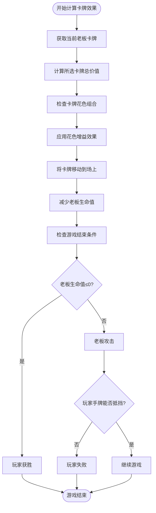
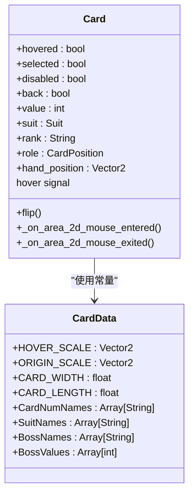
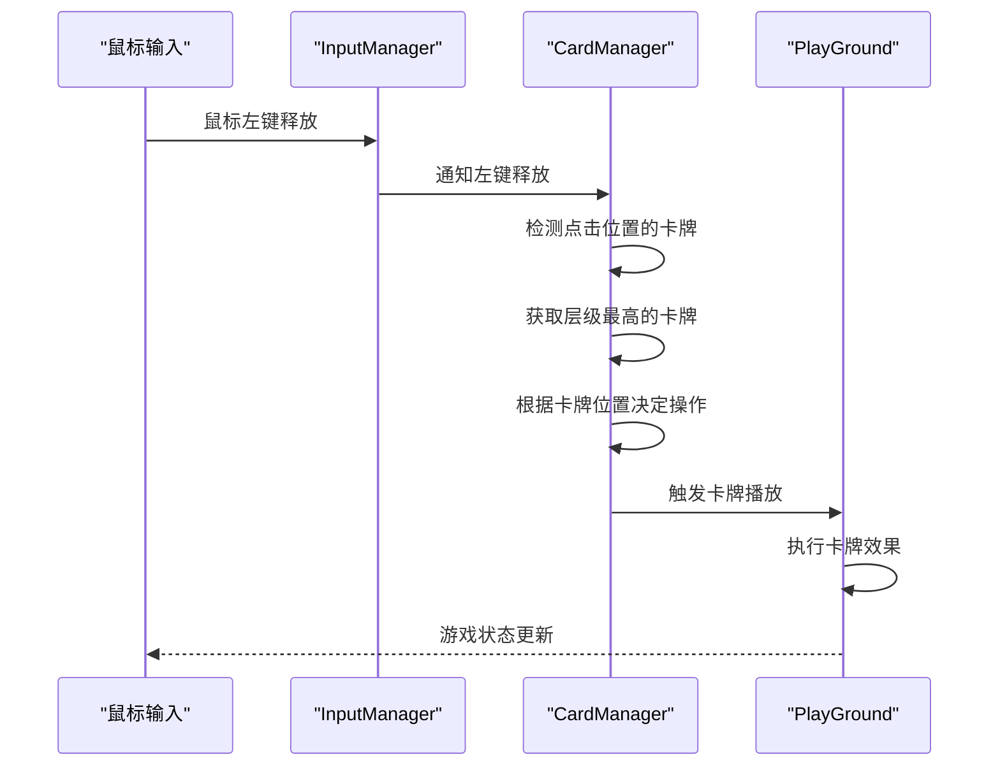

# 关键技术实现

<cite>
**本文档中引用的文件**   
- [play_ground.gd](file://scripts/play_ground.gd)
- [card.gd](file://scripts/card.gd)
- [card_data.gd](file://scripts/card_data.gd)
- [card_manager.gd](file://scripts/card_manager.gd)
- [hand.gd](file://scripts/hand.gd)
- [deck.gd](file://scripts/deck.gd)
- [input_manager.gd](file://scripts/input_manager.gd)
</cite>

## 目录
1. [卡牌效果计算与胜负判定逻辑](#卡牌效果计算与胜负判定逻辑)
2. [动画触发与状态变化机制](#动画触发与状态变化机制)
3. [输入响应机制](#输入响应机制)
4. [优化建议与典型bug案例](#优化建议与典型bug案例)

## 卡牌效果计算与胜负判定逻辑

在Regicide游戏中，卡牌效果的计算和胜负判定逻辑主要由`play_ground.gd`文件中的`card_effect`函数实现。该函数根据玩家选择的卡牌类型和目标，计算伤害或增益效果，并应用到老板或玩家身上。

卡牌效果的计算流程如下：
1. 获取当前老板卡牌
2. 计算所选卡牌的总价值
3. 检查卡牌花色组合，应用相应的增益效果
4. 根据花色组合对伤害值进行倍数计算
5. 将卡牌移动到场上
6. 减少老板生命值
7. 检查游戏结束条件

花色组合的增益效果包括：
- 梅花：伤害值翻倍
- 红心：将弃牌堆的卡牌放回牌堆
- 方块：从牌堆抽卡
- 黑桃：减少老板的攻击力

游戏结束条件的判断逻辑如下：
- 当老板生命值归零时，玩家获胜
- 当玩家手牌不足以抵挡老板攻击时，玩家失败
- 当牌堆和老板牌堆都为空时，玩家获胜

**图示来源**
- [play_ground.gd](file://scripts/play_ground.gd#L30-L58)

**本节来源**
- [play_ground.gd](file://scripts/play_ground.gd#L30-L58)
- [card_data.gd](file://scripts/card_data.gd#L45-L48)

## 动画触发与状态变化机制

卡牌的动画播放与状态变化联动机制主要在`card.gd`文件中实现。该机制通过信号和属性监听器来触发动画和状态变化。

卡牌状态变化主要包括：
- 悬停状态：鼠标悬停时，卡牌放大并提升层级
- 选中状态：卡牌被选中时，改变外观
- 禁用状态：卡牌不可用时，显示遮罩
- 翻转状态：卡牌从背面翻转到正面

动画触发机制如下：
1. 当鼠标进入卡牌区域时，触发悬停信号
2. 悬停信号被监听并设置卡牌的hovered属性
3. hovered属性的setter函数根据值改变卡牌的缩放和层级
4. 当卡牌需要翻转时，播放翻转动画

**图示来源**
- [card.gd](file://scripts/card.gd#L1-L67)
- [card_data.gd](file://scripts/card_data.gd#L40-L57)

**本节来源**
- [card.gd](file://scripts/card.gd#L1-L67)
- [card_data.gd](file://scripts/card_data.gd#L40-L57)

## 输入响应机制

输入事件通过CardManager传递至PlayGround并触发相应动作的机制如下：

1. InputManager监听输入事件
2. CardManager处理鼠标点击事件
3. 根据点击位置和卡牌状态决定操作
4. 触发相应的游戏动作

具体流程：
- 当鼠标左键释放时，CardManager检测点击位置的卡牌
- 如果卡牌在手牌中，则选中卡牌
- 如果卡牌在牌堆中，则将卡牌添加到手牌
- 选中卡牌后，PlayGround监听到卡牌播放信号并执行相应动作

**图示来源**
- [card_manager.gd](file://scripts/card_manager.gd#L1-L85)
- [play_ground.gd](file://scripts/play_ground.gd#L17-L20)
- [input_manager.gd](file://scripts/input_manager.gd#L1-L40)

**本节来源**
- [card_manager.gd](file://scripts/card_manager.gd#L1-L85)
- [play_ground.gd](file://scripts/play_ground.gd#L17-L20)
- [input_manager.gd](file://scripts/input_manager.gd#L1-L40)

## 优化建议与典型bug案例

### 优化建议

1. **减少重复计算**
   - 在`card_effect`函数中，对花色数组的初始化和检查可以优化
   - 可以预先计算花色组合的效果，避免每次重复计算
   - 使用缓存机制存储常用的计算结果

2. **合理使用信号避免内存泄漏**
   - 确保信号连接在节点释放时正确断开
   - 使用弱引用避免循环引用
   - 在_on_exit_tree中清理所有信号连接

3. **性能优化**
   - 减少每帧的计算量，将不必要的计算移到需要时再执行
   - 使用对象池管理卡牌实例，避免频繁的创建和销毁
   - 优化动画播放，避免同时播放过多动画

### 典型bug案例及解决方法

1. **卡牌选中状态异常**
   - 问题：卡牌在特定情况下无法正确选中或取消选中
   - 原因：手牌更新位置时未正确处理选中状态
   - 解决：在`update_position`函数中确保正确更新选中卡牌状态

2. **花色效果应用错误**
   - 问题：特定花色组合的效果未正确应用
   - 原因：花色数组初始化逻辑有误
   - 解决：确保花色数组正确初始化为布尔值数组

3. **游戏结束条件判断错误**
   - 问题：在特定情况下游戏结束条件判断不准确
   - 原因：老板生命值归零后的处理逻辑有缺陷
   - 解决：在`card_effect`函数中完善游戏结束条件的判断逻辑

4. **输入响应延迟**
   - 问题：鼠标点击后卡牌响应有延迟
   - 原因：物理查询和层级判断消耗过多时间
   - 解决：优化`_get_highest`函数的性能，减少不必要的循环

**本节来源**
- [play_ground.gd](file://scripts/play_ground.gd#L30-L58)
- [card.gd](file://scripts/card.gd#L1-L67)
- [card_manager.gd](file://scripts/card_manager.gd#L1-L85)
- [hand.gd](file://scripts/hand.gd#L1-L68)