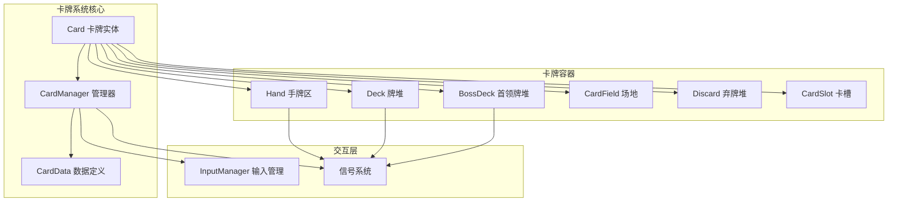
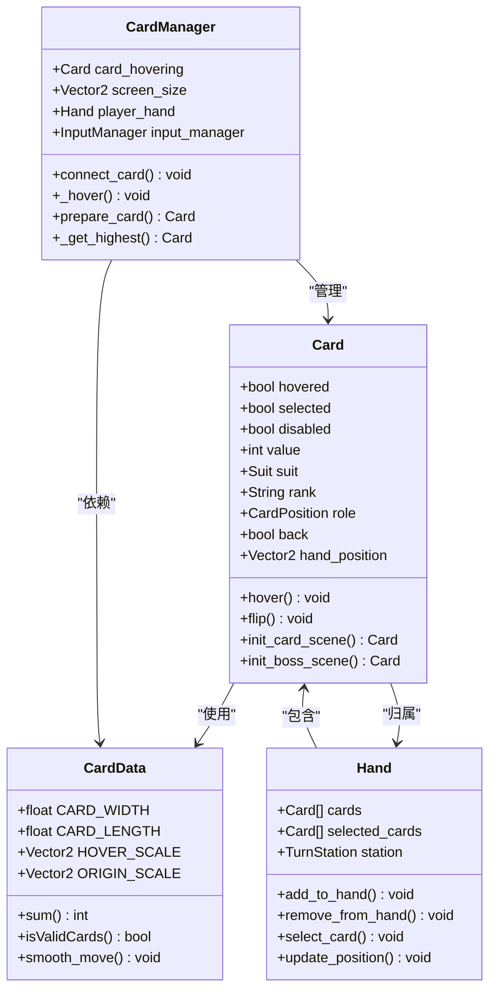
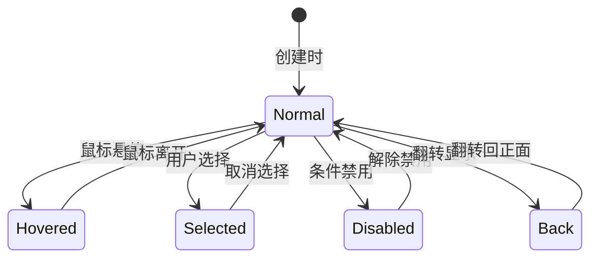
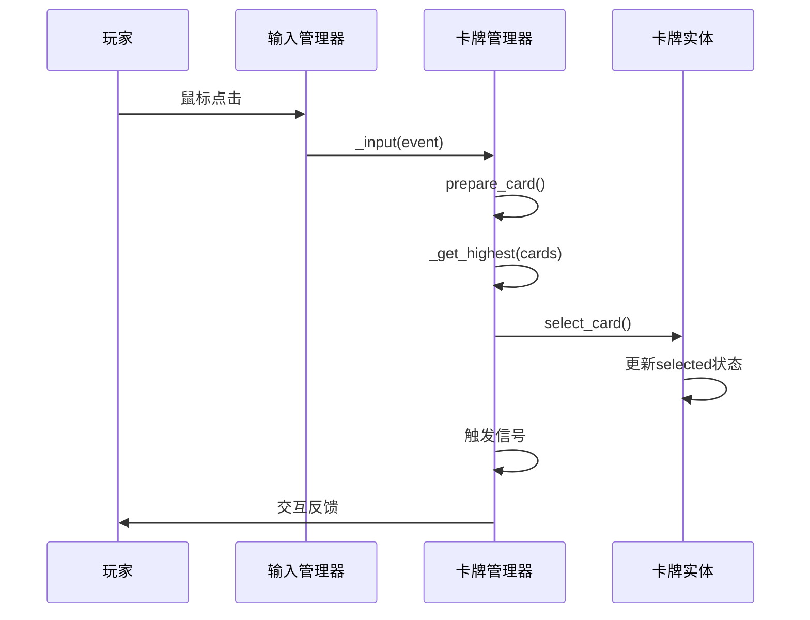
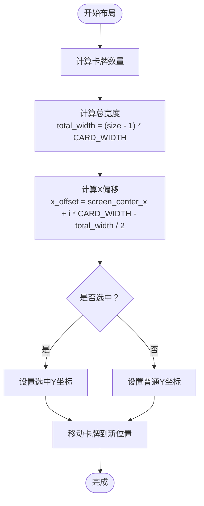
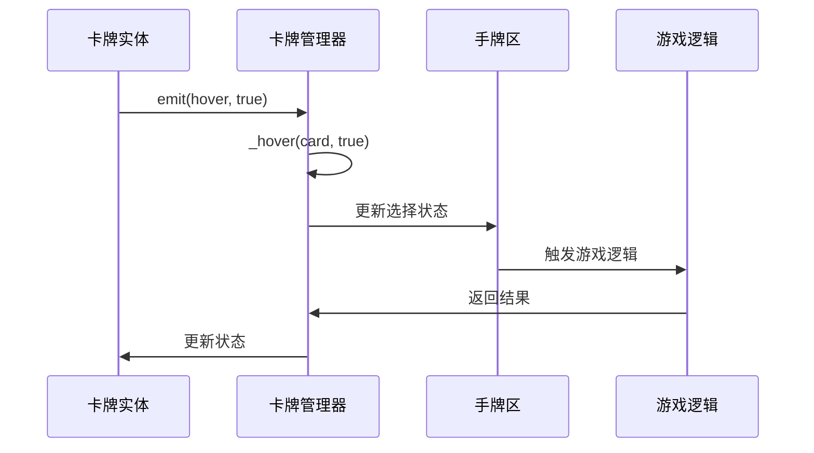
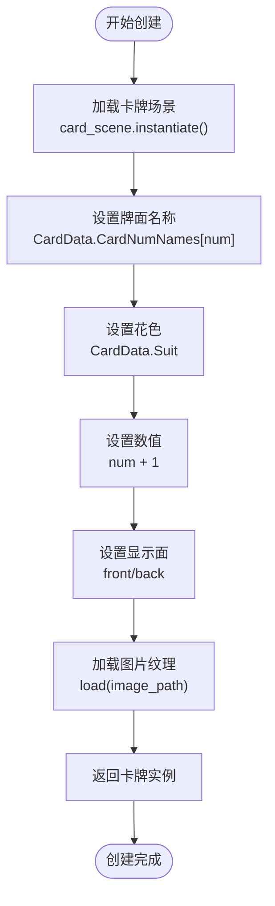

# 卡牌系统

<cite>
**本文档引用的文件**
- [card.gd](file://scripts/card.gd)
- [card_manager.gd](file://scripts/card_manager.gd)
- [card_data.gd](file://scripts/card_data.gd)
- [hand.gd](file://scripts/hand.gd)
- [deck.gd](file://scripts/deck.gd)
- [card_field.gd](file://scripts/card_field.gd)
- [boss_deck.gd](file://scripts/boss_deck.gd)
- [discard.gd](file://scripts/discard.gd)
- [card_slot.gd](file://scripts/card_slot.gd)
</cite>

## 目录
1. [简介](#简介)
2. [系统架构概览](#系统架构概览)
3. [核心组件详解](#核心组件详解)
4. [卡牌实体（Card）](#卡牌实体card)
5. [卡牌管理器（CardManager）](#卡牌管理器cardmanager)
6. [卡牌数据定义（CardData）](#卡牌数据定义carddata)
7. [卡牌容器组件](#卡牌容器组件)
8. [交互机制与信号系统](#交互机制与信号系统)
9. [卡牌创建与生命周期](#卡牌创建与生命周期)
10. [性能优化与最佳实践](#性能优化与最佳实践)
11. [常见问题与调试指南](#常见问题与调试指南)
12. [总结](#总结)

## 简介

Regicide卡牌系统是一个基于Godot引擎开发的完整卡牌游戏框架，采用模块化设计，包含卡牌实体、管理器、数据定义和各种容器组件。该系统支持完整的卡牌生命周期管理，包括创建、移动、选择、动画和销毁等操作，并提供了丰富的交互功能和视觉效果。

系统的核心设计理念是通过三个主要组件的协作来实现复杂的卡牌逻辑：
- **Card**：卡牌实体，负责单张卡牌的状态管理和视觉表现
- **CardManager**：卡牌管理器，处理用户输入和全局卡牌交互
- **CardData**：数据定义，提供静态配置和验证规则

## 系统架构概览



**图表来源**
- [card.gd](file://scripts/card.gd#L1-L67)
- [card_manager.gd](file://scripts/card_manager.gd#L1-L85)
- [card_data.gd](file://scripts/card_data.gd#L1-L72)

## 核心组件详解

### 组件关系图



**图表来源**
- [card.gd](file://scripts/card.gd#L1-L67)
- [card_manager.gd](file://scripts/card_manager.gd#L1-L85)
- [card_data.gd](file://scripts/card_data.gd#L1-L72)
- [hand.gd](file://scripts/hand.gd#L1-L68)

## 卡牌实体（Card）

### 基本属性与状态管理

Card类是卡牌系统的核心实体，继承自Node2D，负责单张卡牌的所有状态管理和视觉表现。

#### 核心属性

| 属性名 | 类型 | 描述 | 默认值 |
|--------|------|------|--------|
| `hovered` | bool | 是否处于悬停状态 | false |
| `selected` | bool | 是否被选中 | false |
| `disabled` | bool | 是否被禁用 | false |
| `value` | int | 卡牌数值 | - |
| `suit` | Suit | 花色枚举 | - |
| `rank` | String | 牌面名称 | - |
| `role` | CardPosition | 卡牌位置角色 | - |
| `back` | bool | 是否显示背面 | false |
| `hand_position` | Vector2 | 手牌位置坐标 | - |

#### 状态变化机制



**节来源**
- [card.gd](file://scripts/card.gd#L5-L20)

### 视觉效果与动画

#### 悬停效果实现

卡牌的悬停效果通过缩放变换实现，当鼠标悬停时自动放大到1.05倍，离开时恢复原尺寸。

#### 翻转动画

卡牌翻转通过AnimationPlayer节点实现，支持普通卡牌和首领卡牌的不同翻转效果。

**节来源**
- [card.gd](file://scripts/card.gd#L35-L37)

### 卡牌初始化方法

系统提供两种静态初始化方法：

1. **init_card_scene()**：用于普通卡牌的创建
2. **init_boss_scene()**：用于首领卡牌的创建

这两种方法都接受花色、数值和是否显示背面作为参数，返回完整的卡牌实例。

**节来源**
- [card.gd](file://scripts/card.gd#L37-L55)

## 卡牌管理器（CardManager）

### 输入处理与交互逻辑

CardManager负责处理所有用户输入和卡牌交互逻辑，是整个卡牌系统的核心控制器。

#### 主要职责

1. **鼠标事件处理**：监听鼠标按键事件，识别点击操作
2. **卡牌选择管理**：处理卡牌的选择、取消选择和批量操作
3. **拖拽功能**：支持卡牌的拖拽移动
4. **悬停检测**：实时检测鼠标悬停的卡牌对象

#### 输入事件流程



**图表来源**
- [card_manager.gd](file://scripts/card_manager.gd#L9-L17)

**节来源**
- [card_manager.gd](file://scripts/card_manager.gd#L9-L17)

### 卡牌选择与高亮机制

#### 悬停状态管理

CardManager维护当前悬停的卡牌对象，确保同一时间只有一个卡牌处于悬停状态。

#### 碰撞检测算法

系统使用PhysicsPointQueryParameters2D进行精确的碰撞检测，优先返回z-index最高的卡牌。

**节来源**
- [card_manager.gd](file://scripts/card_manager.gd#L34-L46)

### 卡牌拖拽实现

虽然当前版本的拖拽功能被注释掉，但系统已经实现了基本的拖拽框架：

1. **准备阶段**：通过prepare_card()方法确定目标卡牌
2. **拖拽执行**：根据卡牌位置执行不同的拖拽逻辑
3. **位置更新**：实时更新卡牌的位置以跟随鼠标

**节来源**
- [card_manager.gd](file://scripts/card_manager.gd#L18-L22)

## 卡牌数据定义（CardData）

### 枚举类型定义

CardData作为静态数据容器，定义了卡牌系统所需的所有枚举类型和常量。

#### 卡牌数值枚举

| 数值 | 名称 | 值 |
|------|------|-----|
| ACE | A | 0 |
| TWO | 2 | 1 |
| TREE | 3 | 2 |
| FOUR | 4 | 3 |
| FIVE | 5 | 4 |
| SIX | 6 | 5 |
| SEVEN | 7 | 6 |
| EIGHT | 8 | 7 |
| NINE | 9 | 8 |
| TEN | 10 | 9 |

#### 花色枚举

| 花色 | 名称 |
|------|------|
| SPADE | 黑桃 |
| DIAMOND | 方块 |
| HEART | 红心 |
| CLUB | 梅花 |

#### 首领卡枚举

| 首领 | 名称 | 数值 |
|------|------|------|
| JACK | 杰克 | 10 |
| QUEEN | 皇后 | 15 |
| KING | 国王 | 20 |

**节来源**
- [card_data.gd](file://scripts/card_data.gd#L2-L27)

### 卡牌位置与状态

#### 卡牌位置枚举

| 位置 | 描述 |
|------|------|
| DECK | 牌堆 |
| HAND | 手牌 |
| FIELD | 场地 |
| BOSS | 首领 |
| DISCARD | 弃牌堆 |

#### 游戏状态枚举

| 状态 | 描述 |
|------|------|
| PLAYER | 玩家回合 |
| DEFEND | 防御状态 |

**节来源**
- [card_data.gd](file://scripts/card_data.gd#L29-L38)

### 尺寸与动画常量

#### 卡牌尺寸

| 参数 | 值 |
|------|-----|
| CARD_WIDTH | 73.2 |
| CARD_LENGTH | 102.4 |

#### 动画缩放

| 缩放类型 | 值 |
|----------|-----|
| HOVER_SCALE | (1.05, 1.05) |
| ORIGIN_SCALE | (1, 1) |

**节来源**
- [card_data.gd](file://scripts/card_data.gd#L40-L42)

### 核心算法函数

#### 卡牌有效性验证

`isValidCards()`函数实现了卡牌组合的有效性检查，确保玩家出牌符合游戏规则。

#### 平滑移动

`smooth_move()`函数提供卡牌位置的平滑过渡动画，提升用户体验。

**节来源**
- [card_data.gd](file://scripts/card_data.gd#L57-L72)

## 卡牌容器组件

### 手牌区（Hand）

手牌区是玩家可见的主要卡牌区域，负责管理玩家手中的卡牌。

#### 核心功能

1. **卡牌布局计算**：自动计算手牌的排列位置
2. **选择状态管理**：处理卡牌的选择和取消选择
3. **有效性验证**：根据游戏规则验证卡牌组合
4. **视觉效果控制**：管理卡牌的启用/禁用状态

#### 布局算法



**图表来源**
- [hand.gd](file://scripts/hand.gd#L55-L57)

**节来源**
- [hand.gd](file://scripts/hand.gd#L37-L47)

### 牌堆（Deck）

牌堆负责管理游戏开始时的初始卡牌和抽牌逻辑。

#### 初始化流程

1. **卡牌生成**：创建4种花色各10张的完整牌组
2. **洗牌处理**：随机打乱卡牌顺序
3. **位置设置**：将卡牌放置在牌堆位置

#### 抽牌机制

抽牌功能支持批量抽牌，每次最多抽取指定数量的卡牌到手牌区。

**节来源**
- [deck.gd](file://scripts/deck.gd#L8-L15)

### 首领牌堆（BossDeck）

首领牌堆专门用于管理游戏中的首领卡牌，具有特殊的健康值和攻击力系统。

#### 首领属性系统

每个首领卡牌都有独立的健康值和攻击力属性，这些属性会随着卡牌的使用而动态变化。

#### 首领切换机制

当当前首领被击败后，系统会自动从牌堆中抽取新的首领卡牌。

**节来源**
- [boss_deck.gd](file://scripts/boss_deck.gd#L34-L45)

### 弃牌堆（Discard）

弃牌堆用于存放被丢弃的卡牌，支持重新洗牌和回收利用。

#### 弃牌处理

1. **卡牌回收**：将使用后的卡牌回收到弃牌堆
2. **随机抽取**：支持从弃牌堆中随机抽取卡牌
3. **重新洗牌**：可以将弃牌堆重新洗牌后放入主牌堆

**节来源**
- [discard.gd](file://scripts/discard.gd#L12-L16)

## 交互机制与信号系统

### 信号连接机制

卡牌系统采用基于信号的松耦合设计，各个组件通过信号进行通信。

#### 主要信号

| 信号名称 | 发送者 | 参数 | 用途 |
|----------|--------|------|------|
| `hover` | Card | (Card, bool) | 卡牌悬停状态变化 |
| `card_played` | CardManager | (Card, Vector2) | 卡牌被打出 |

#### 信号传播流程



**图表来源**
- [card_manager.gd](file://scripts/card_manager.gd#L32-L33)

**节来源**
- [card.gd](file://scripts/card.gd#L2-L3)

### 用户输入处理

#### 鼠标交互

系统支持多种鼠标交互模式：

1. **点击选择**：左键点击选择卡牌
2. **悬停高亮**：鼠标悬停时自动高亮
3. **批量操作**：支持Ctrl+点击进行批量选择

#### 键盘快捷键

虽然当前版本未实现键盘快捷键，但系统预留了扩展接口，可以方便地添加键盘控制功能。

**节来源**
- [card_manager.gd](file://scripts/card_manager.gd#L9-L17)

## 卡牌创建与生命周期

### 卡牌创建流程



**图表来源**
- [card.gd](file://scripts/card.gd#L37-L45)

**节来源**
- [card.gd](file://scripts/card.gd#L37-L45)

### 卡牌生命周期

#### 创建阶段

1. **场景实例化**：从预加载的场景模板创建卡牌
2. **属性初始化**：设置卡牌的基本属性
3. **纹理加载**：加载对应的卡牌图像

#### 运行阶段

1. **状态管理**：根据游戏逻辑更新卡牌状态
2. **视觉更新**：响应状态变化更新外观
3. **交互处理**：处理用户输入和事件

#### 销毁阶段

1. **清理资源**：释放卡牌占用的资源
2. **状态重置**：重置相关状态变量
3. **内存回收**：确保垃圾回收机制正常工作

**节来源**
- [card.gd](file://scripts/card.gd#L32-L33)

## 性能优化与最佳实践

### 内存管理

#### 对象池化

对于频繁创建和销毁的卡牌对象，建议实现对象池机制，避免重复的内存分配和垃圾回收。

#### 纹理缓存

系统已经实现了纹理的预加载机制，避免运行时的纹理加载开销。

### 渲染优化

#### 批量渲染

将相同类型的卡牌合并到同一个渲染批次中，减少绘制调用次数。

#### 纹理图集

考虑将所有卡牌图像打包到一个大的纹理图集中，进一步提升渲染性能。

### 交互优化

#### 碰撞检测优化

使用空间分割算法（如四叉树）优化大量卡牌的碰撞检测性能。

#### 事件处理优化

采用事件委托模式，减少事件处理器的数量，提升事件处理效率。

## 常见问题与调试指南

### 卡牌状态不一致

#### 问题症状
- 卡牌显示状态与实际状态不符
- 选择状态无法正确同步
- 禁用状态异常

#### 调试步骤
1. 检查信号连接是否正确建立
2. 验证状态更新逻辑的完整性
3. 确认UI更新时机的正确性

#### 解决方案
```gdscript
# 在状态更新后强制刷新UI
func update_card_visual():
    card.update_visual_state()
    card.queue_redraw()
```

### 点击无响应

#### 问题症状
- 鼠标点击无法选中卡牌
- 悬停效果不生效
- 卡牌无法拖拽

#### 常见原因
1. 碰撞形状配置错误
2. 输入事件被其他节点拦截
3. z-index层级问题

#### 调试方法
```gdscript
# 添加调试输出
print("Card position:", card.global_position)
print("Mouse position:", get_global_mouse_position())
print("Collision mask:", card.collision_layer)
```

### 性能问题

#### 卡顿现象
- 大量卡牌同时移动时出现卡顿
- 翻转动画播放不流畅
- 内存占用过高

#### 优化建议
1. 限制同时移动的卡牌数量
2. 使用Tween节点替代手动动画
3. 定期清理不需要的卡牌对象

### 卡牌位置错误

#### 问题症状
- 卡牌排列位置不正确
- 手牌重叠或间距过大
- 移动轨迹异常

#### 解决方案
1. 检查屏幕尺寸获取逻辑
2. 验证坐标转换的准确性
3. 确认布局算法的正确性

## 总结

Regicide卡牌系统通过精心设计的三层架构（Card、CardManager、CardData），实现了功能完整、性能优良的卡牌游戏框架。系统的主要优势包括：

### 设计优势

1. **模块化架构**：清晰的职责分离，便于维护和扩展
2. **信号驱动**：松耦合的组件通信机制
3. **类型安全**：完整的枚举和类型定义
4. **性能优化**：内置的动画和渲染优化

### 功能特性

1. **完整的生命周期**：从创建到销毁的全流程管理
2. **丰富的交互**：支持点击、悬停、拖拽等多种交互
3. **灵活的配置**：通过CardData轻松调整游戏规则
4. **良好的扩展性**：预留了多个扩展点

### 应用价值

该卡牌系统不仅适用于Regicide游戏，还可以作为其他卡牌游戏的基础框架，为开发者提供了一个可靠、高效的解决方案。通过合理的架构设计和性能优化，系统能够在保证功能完整性的同时，提供流畅的游戏体验。

对于希望开发卡牌游戏的开发者来说，这套系统提供了一个优秀的参考实现，展示了如何在Godot引擎中构建复杂的游戏逻辑和交互系统。