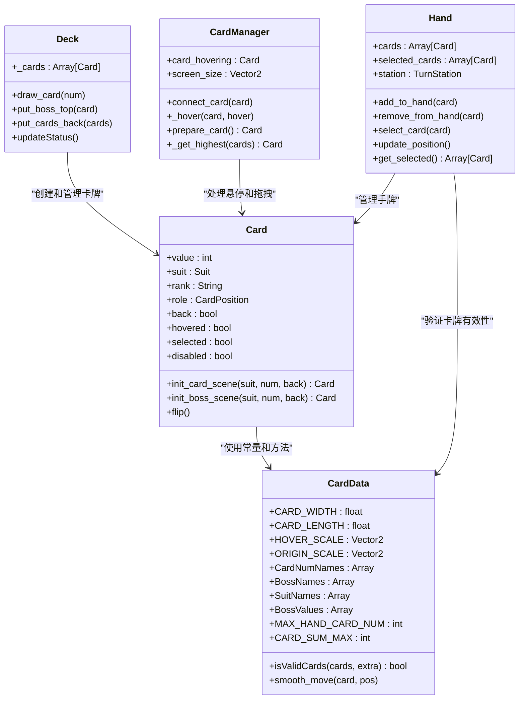
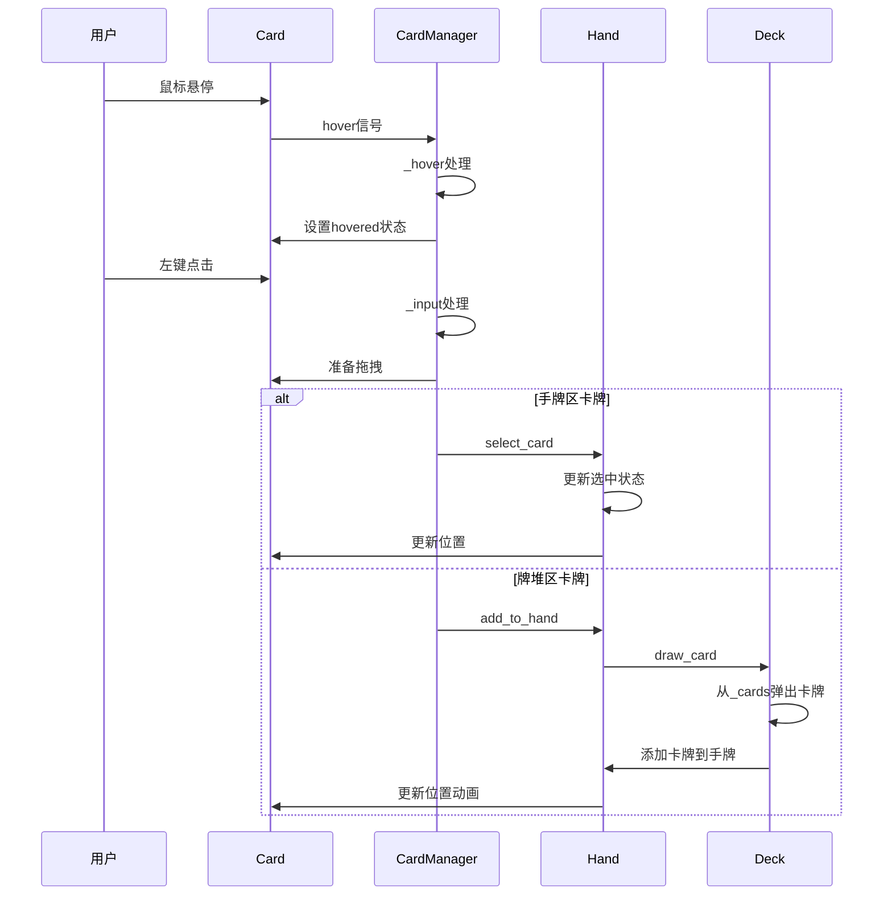

# 开发指南

<cite>
**本文档中引用的文件**  
- [project.godot](file://project.godot)
- [card.gd](file://scripts/card.gd)
- [card_data.gd](file://scripts/card_data.gd)
- [card_manager.gd](file://scripts/card_manager.gd)
- [hand.gd](file://scripts/hand.gd)
- [deck.gd](file://scripts/deck.gd)
- [card_slot.gd](file://scripts/card_slot.gd)
- [input_manager.gd](file://scripts/input_manager.gd)
- [THIRDPARTY.md](file://addons/godot-git-plugin/THIRDPARTY.md)
</cite>

## 目录
1. [简介](#简介)
2. [项目结构](#项目结构)
3. [环境搭建](#环境搭建)
4. [项目配置与导入](#项目配置与导入)
5. [版本控制](#版本控制)
6. [核心组件分析](#核心组件分析)
7. [常见开发任务](#常见开发任务)
8. [调试技巧](#调试技巧)
9. [代码贡献规范](#代码贡献规范)
10. [第三方依赖许可](#第三方依赖许可)

## 简介
本开发指南旨在为新加入的开发者提供全面的入门指导，涵盖从环境搭建到代码贡献的完整流程。Regicide是一款基于Godot引擎开发的卡牌游戏项目，采用模块化设计，便于扩展和维护。通过本指南，开发者将快速掌握项目结构、核心机制和开发规范，高效参与项目开发。

## 项目结构
Regicide项目采用标准的Godot项目结构，主要分为场景（scenes）和脚本（scripts）两大目录。核心游戏逻辑由GDScript实现，通过节点系统组织。项目使用godot-git-plugin进行版本控制，确保代码协作的顺畅。

```
regicide/
├── addons/
│   └── godot-git-plugin/
│       └── THIRDPARTY.md
├── scenes/
│   ├── boss_deck.tscn
│   ├── card.tscn
│   ├── card_field.tscn
│   ├── card_manager.tscn
│   ├── card_slot.tscn
│   ├── deck.tscn
│   ├── discard.tscn
│   ├── game_scene.tscn
│   ├── input_manager.tscn
│   ├── node_2d.tscn
│   └── player.tscn
└── scripts/
    ├── boss_deck.gd
    ├── button.gd
    ├── card.gd
    ├── card_data.gd
    ├── card_field.gd
    ├── card_manager.gd
    ├── card_slot.gd
    ├── deck.gd
    ├── discard.gd
    ├── hand.gd
    ├── input_manager.gd
    ├── play_ground.gd
    ├── player.gd
    └── players.gd
```

**Section sources**
- [project.godot](file://project.godot#L1-L30)

## 环境搭建
要开始开发Regicide项目，请按照以下步骤设置开发环境：

1. **安装Godot 4.5引擎**  
   访问[Godot官网](https://godotengine.org/)下载并安装Godot 4.5版本。确保选择与您操作系统匹配的版本。

2. **克隆项目仓库**  
   使用Git克隆项目到本地：
   ```bash
   git clone https://github.com/your-repo/regicide.git
   ```

3. **导入项目**  
   打开Godot编辑器，选择"Import"选项，浏览到项目根目录下的`project.godot`文件并导入。

4. **验证环境**  
   导入后，点击"Play"按钮运行项目，确保游戏能够正常启动并显示主界面。

**Section sources**
- [project.godot](file://project.godot#L1-L30)

## 项目配置与导入
项目配置通过`project.godot`文件管理，该文件定义了项目的基本属性和运行参数。

- **项目名称**：REGICIDE
- **主场景**：`res://scenes/node_2d.tscn`
- **渲染方法**：mobile
- **自动加载**：`CardData`脚本作为单例全局可用
- **版本控制插件**：已配置使用GitPlugin

在Godot编辑器中，可通过"Project" → "Project Settings"查看和修改这些配置。`CardData`脚本的自动加载使得卡牌数据在整个项目中可直接访问，无需重复实例化。

**Section sources**
- [project.godot](file://project.godot#L1-L30)
- [card_data.gd](file://scripts/card_data.gd#L1-L72)

## 版本控制
项目已集成godot-git-plugin，提供内置的Git版本控制功能。

### 启用Git插件
1. 在Godot编辑器中，进入"Editor" → "Version Control"
2. 确保"Plugin Name"设置为"GitPlugin"
3. 勾选"Autoload on Startup"以在项目启动时自动初始化

### 基本操作流程
1. **初始化仓库**：首次打开项目时，插件会提示初始化Git仓库
2. **文件状态**：在编辑器底部状态栏可查看文件修改状态
3. **提交更改**：通过版本控制面板添加修改的文件并提交
4. **分支管理**：支持创建和切换分支，建议为每个功能或修复创建独立分支

**Section sources**
- [project.godot](file://project.godot#L24-L25)
- [THIRDPARTY.md](file://addons/godot-git-plugin/THIRDPARTY.md#L1-L1347)

## 核心组件分析
Regicide项目的核心组件围绕卡牌系统构建，各组件通过信号和方法调用实现交互。

### 卡牌系统架构


**Diagram sources**
- [card.gd](file://scripts/card.gd#L1-L67)
- [card_data.gd](file://scripts/card_data.gd#L1-L72)
- [hand.gd](file://scripts/hand.gd#L1-L68)
- [deck.gd](file://scripts/deck.gd#L1-L40)
- [card_manager.gd](file://scripts/card_manager.gd#L1-L85)

### 组件交互流程


**Diagram sources**
- [card.gd](file://scripts/card.gd#L62-L67)
- [card_manager.gd](file://scripts/card_manager.gd#L9-L17)
- [hand.gd](file://scripts/hand.gd#L25-L35)
- [deck.gd](file://scripts/deck.gd#L20-L31)

## 常见开发任务
### 添加新卡牌类型
1. 在`card_data.gd`中扩展`CardNum`枚举，添加新卡牌数值
2. 在`CardData.CardNumNames`数组中添加对应的名称
3. 确保资源目录`res://images/`中存在对应的新卡牌图像文件
4. 在需要的地方调用`Card.init_card_scene()`创建新类型卡牌

### 修改游戏规则
游戏规则主要由`CardData.isValidCards()`方法定义：
```gdscript
func isValidCards(cards:Array[Card],extra:Card)->bool:
    cards = cards.duplicate()
    cards.push_back(extra)
    if cards.size()<=1:
        return true
    var val = cards[0].value
    for card in cards:
        if not (card.value==1 or card.value==val):
            return false
    return cards.reduce(CardData.sum,0)<=CARD_SUM_MAX
```
修改此方法可调整卡牌组合规则，如改变同值卡牌限制或总点数上限。

### 调试卡牌交互问题
1. 检查卡牌的`role`属性是否正确设置
2. 验证`collision_mask`设置是否正确
3. 使用场景检查器查看节点层级和信号连接
4. 添加日志输出跟踪关键方法的执行

**Section sources**
- [card_data.gd](file://scripts/card_data.gd#L59-L68)
- [hand.gd](file://scripts/hand.gd#L43-L46)
- [card_manager.gd](file://scripts/card_manager.gd#L48-L57)

## 调试技巧
### 断点调试
在Godot编辑器中，可在GDScript代码行号左侧点击设置断点。运行项目时，执行到断点处会暂停，可查看变量状态和调用栈。

### 日志输出
使用`print()`函数输出调试信息：
```gdscript
print("卡牌值:", card.value, "卡牌花色:", card.suit)
```
在输出面板中查看日志内容，帮助追踪程序执行流程。

### 场景检查器
利用场景检查器实时查看：
- 节点属性变化
- 信号连接状态
- 子节点层级结构
- 动画播放状态

### 性能分析
使用Godot内置的Profiler工具监控：
- 节点更新频率
- 内存使用情况
- 脚本执行时间
- 渲染性能指标

**Section sources**
- [card.gd](file://scripts/card.gd#L43-L45)
- [hand.gd](file://scripts/hand.gd#L37-L47)
- [deck.gd](file://scripts/deck.gd#L24-L30)

## 代码贡献规范
为确保代码质量和一致性，请遵守以下贡献规范：

### 命名约定
- **类名**：采用PascalCase，如`CardManager`
- **变量和方法**：采用snake_case，如`card_hovering`
- **常量**：全部大写，单词间用下划线，如`CARD_WIDTH`
- **信号**：采用snake_case，如`hover`

### 注释标准
- 类和方法需有文档注释，说明功能和参数
- 复杂逻辑添加行内注释
- 使用`@warning_ignore`标记已知警告

### 提交信息格式
采用约定式提交（Conventional Commits）：
```
<type>(<scope>): <subject>
<BLANK LINE>
<body>
<BLANK LINE>
<footer>
```
- **type**：feat、fix、docs、style、refactor、test、chore
- **scope**：影响的模块，如card、hand、deck
- **subject**：简短描述，不超过50字符

**Section sources**
- [card.gd](file://scripts/card.gd#L1-L67)
- [hand.gd](file://scripts/hand.gd#L1-L68)
- [deck.gd](file://scripts/deck.gd#L1-L40)

## 第三方依赖许可
项目使用的godot-git-plugin包含以下第三方依赖及其许可信息：

- **godotengine/godot-cpp**：MIT许可证
- **libgit2/libgit2**：GPLv2 with Linking Exception
- **libssh2/libssh2**：BSD-3-Clause许可证
- **openssl**：OpenSSL许可证
- **ZLib**：ZLib许可证
- **Clar框架**：ISC许可证
- **regex库**：GNU LGPL

详细许可文本见`addons/godot-git-plugin/THIRDPARTY.md`文件。所有第三方代码均已按相应许可证要求保留版权说明和许可声明。

**Section sources**
- [THIRDPARTY.md](file://addons/godot-git-plugin/THIRDPARTY.md#L1-L1347)