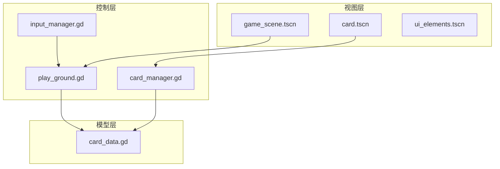
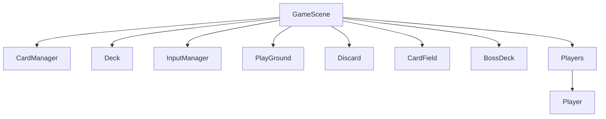
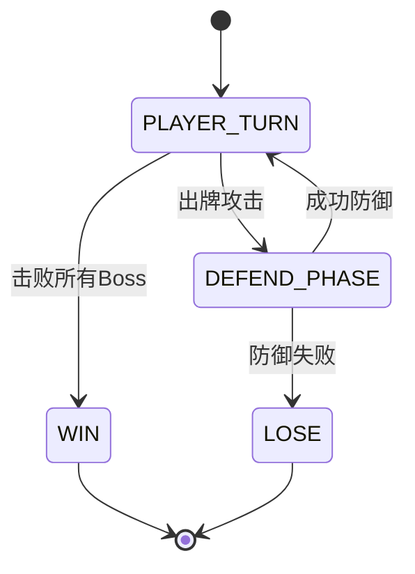
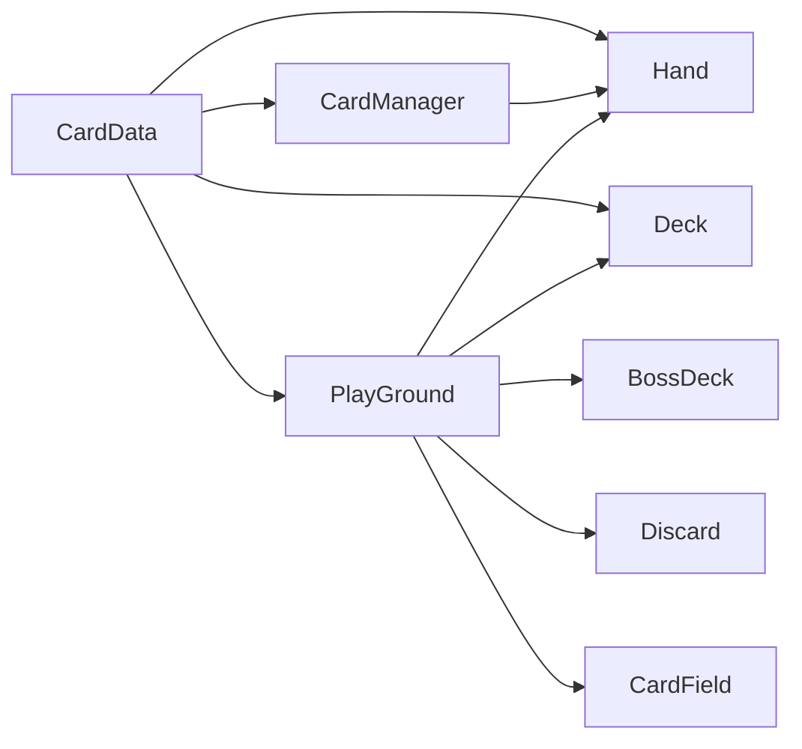

# 架构设计

<cite>
**本文档中引用的文件**  
- [game_scene.tscn](file://scenes/game_scene.tscn)
- [play_ground.gd](file://scripts/play_ground.gd)
- [card_manager.gd](file://scripts/card_manager.gd)
- [card_data.gd](file://scripts/card_data.gd)
- [card.gd](file://scripts/card.gd)
- [hand.gd](file://scripts/hand.gd)
- [deck.gd](file://scripts/deck.gd)
- [card_field.gd](file://scripts/card_field.gd)
- [input_manager.gd](file://scripts/input_manager.gd)
</cite>

## 目录
1. [简介](#简介)
2. [项目结构](#项目结构)
3. [核心组件](#核心组件)
4. [架构概览](#架构概览)
5. [详细组件分析](#详细组件分析)
6. [依赖关系分析](#依赖关系分析)
7. [数据流路径](#数据流路径)
8. [信号机制与通信](#信号机制与通信)
9. [结论](#结论)

## 简介
REGICIDE项目基于Godot引擎实现了一个卡牌游戏系统，采用MVC变体架构进行模块化设计。本文档旨在深入解析其系统架构，涵盖视图层（.tscn场景文件）、控制层（GDScript脚本）和模型层（CardData单例）的组织方式。重点分析GameScene、PlayGround、CardManager等核心组件之间的协作机制，阐明场景层级结构、游戏逻辑中枢设计、信号通信模式以及数据流动路径，为开发者提供清晰的系统交互蓝图，便于后续扩展与调试。

## 项目结构
项目采用功能模块化组织，主要分为`scenes`和`scripts`两个目录：
- `scenes/`：存放所有.tscn场景文件，定义节点层级结构与UI布局
- `scripts/`：存放所有GDScript脚本，实现具体逻辑功能

关键节点以场景实例化方式嵌入主场景game_scene.tscn，通过节点路径引用实现组件间通信。

**Section sources**
- [game_scene.tscn](file://scenes/game_scene.tscn)

## 核心组件
系统由多个职责明确的核心组件构成，包括GameScene（主场景容器）、PlayGround（游戏逻辑中枢）、CardManager（用户输入管理）、Hand（手牌管理）、Deck（牌堆管理）、CardField（出牌区）等。这些组件通过信号与方法调用实现松耦合交互。

**Section sources**
- [play_ground.gd](file://scripts/play_ground.gd#L1-L96)
- [card_manager.gd](file://scripts/card_manager.gd#L1-L85)
- [hand.gd](file://scripts/hand.gd#L1-L68)

## 架构概览
系统采用基于Godot节点树的MVC变体架构：
- **视图层（View）**：由.tscn场景文件构成，如game_scene.tscn、card.tscn等，负责UI展示与节点组织
- **控制层（Controller）**：由GDScript脚本实现，如play_ground.gd、card_manager.gd等，处理用户输入与状态流转
- **模型层（Model）**：由CardData单例（card_data.gd）提供全局常量、枚举与工具函数，作为数据规范中心

**Diagram sources**
- [game_scene.tscn](file://scenes/game_scene.tscn)
- [play_ground.gd](file://scripts/play_ground.gd)
- [card_manager.gd](file://scripts/card_manager.gd)
- [card_data.gd](file://scripts/card_data.gd)

## 详细组件分析

### GameScene场景层级结构
game_scene.tscn作为根节点，通过实例化外部场景实现模块化集成。其子节点包括CardManager、Deck、InputManager、PlayGround、Discard、CardField、BossDeck和Players等，形成清晰的功能分区。各组件通过相对路径（如`$"../Hand"`）获取引用，确保低耦合性。

**Diagram sources**
- [game_scene.tscn](file://scenes/game_scene.tscn)

**Section sources**
- [game_scene.tscn](file://scenes/game_scene.tscn#L1-L45)

### PlayGround游戏逻辑中枢
PlayGround作为游戏状态控制核心，协调回合流程、胜负判断与状态转换。它通过@onready引用关键组件（如player_hand、boss_dec、deck、discard、field），并在_card_effect方法中实现卡牌效果计算逻辑。根据当前station状态（PLAYER或DEFEND），决定是否允许玩家出牌或进入防御阶段，并在boss生命值归零时触发胜利条件。

**Diagram sources**
- [play_ground.gd](file://scripts/play_ground.gd#L10)
- [card_data.gd](file://scripts/card_data.gd#L36-L39)

**Section sources**
- [play_ground.gd](file://scripts/play_ground.gd#L1-L96)

### CardManager输入管理
CardManager负责捕获鼠标输入并识别卡牌交互。通过_physics_process或_input事件检测点击位置，利用PhysicsPointQueryParameters2D进行碰撞查询，确定最上层的Card实例。提供_hover信号响应悬停状态，并通过_drag方法将卡牌拖入手牌或选中区域，实现用户交互的底层支持。

**Section sources**
- [card_manager.gd](file://scripts/card_manager.gd#L9-L85)
- [card.gd](file://scripts/card.gd#L62-L67)

## 依赖关系分析
系统组件间存在明确的依赖关系：
- PlayGround依赖Hand、Deck、BossDeck、Discard、CardField等进行状态读取与操作
- CardManager依赖Hand进行卡牌添加与选择
- 所有脚本依赖CardData获取枚举值、常量与工具函数
- 场景文件通过instance=ExtResource引用外部场景，形成实例化依赖

**Diagram sources**
- [card_data.gd](file://scripts/card_data.gd)
- [play_ground.gd](file://scripts/play_ground.gd)
- [card_manager.gd](file://scripts/card_manager.gd)
- [hand.gd](file://scripts/hand.gd)
- [deck.gd](file://scripts/deck.gd)

## 数据流路径
系统遵循清晰的数据流动路径：  
**用户输入 → CardManager → PlayGround → UI反馈**

1. 用户点击卡牌，触发CardManager的_input事件
2. CardManager通过prepare_card识别目标Card，并触发_hover或_drag
3. Drag操作导致Hand.select_card被调用，更新selected状态
4. 用户确认出牌，PlayGround监听到_card_play信号，调用_player_action
5. PlayGround执行card_effect，更新Boss状态、牌堆、弃牌堆等
6. 各组件调用fresh_pos或update_position刷新UI显示

该流程确保了从输入到反馈的完整闭环。

**Section sources**
- [card_manager.gd](file://scripts/card_manager.gd#L9-L17)
- [hand.gd](file://scripts/hand.gd#L49-L53)
- [play_ground.gd](file://scripts/play_ground.gd#L17-L28)

## 信号机制与通信
系统广泛使用Godot信号机制实现松耦合通信：
- Card定义hover信号，通知悬停状态变化
- InputManager可定义on_left_release信号（当前未启用）
- PlayGround监听Card的play信号（通过_card_play）触发游戏逻辑
- Hand在select_card后自动调用update_position刷新布局
- Deck在draw_card后触发动画与状态更新

这种基于信号的事件驱动模型，有效解耦了组件间的直接依赖，提升了系统的可维护性与扩展性。

**Section sources**
- [card.gd](file://scripts/card.gd#L2)
- [input_manager.gd](file://scripts/input_manager.gd#L2-L3)
- [play_ground.gd](file://scripts/play_ground.gd#L17)

## 结论
REGICIDE项目通过Godot的节点系统实现了清晰的MVC变体架构。视图层由.tscn文件组织，控制层由GDScript实现业务逻辑，模型层由CardData统一数据规范。PlayGround作为游戏逻辑中枢，协调各组件完成回合制卡牌对战的核心流程。信号机制与节点引用相结合，构建了高效、低耦合的组件通信体系。该架构为后续功能扩展（如多人模式、新卡牌类型）提供了良好的基础结构。