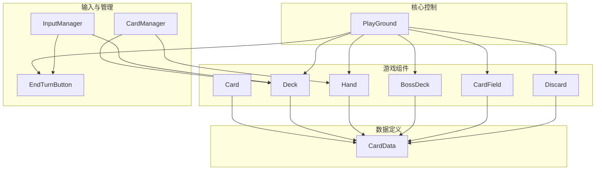
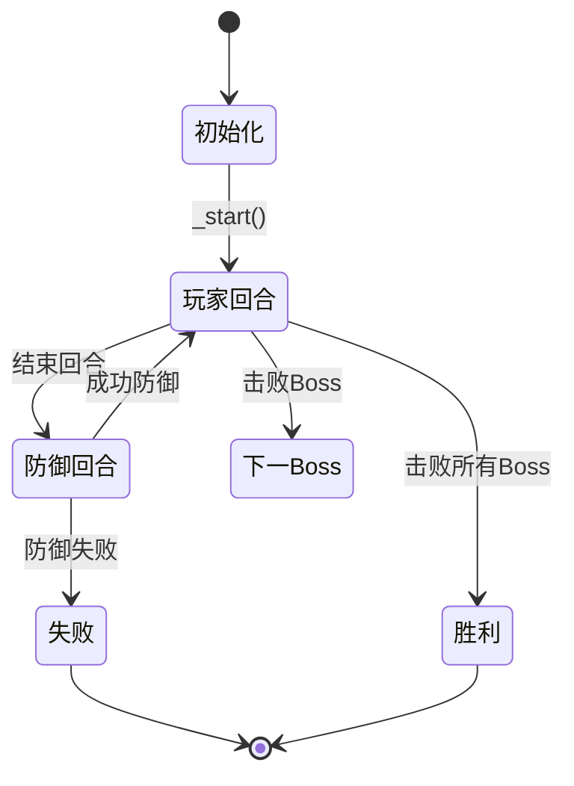
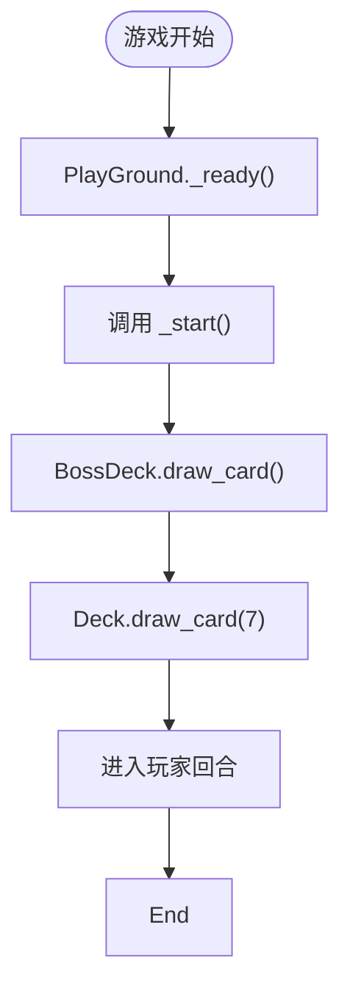
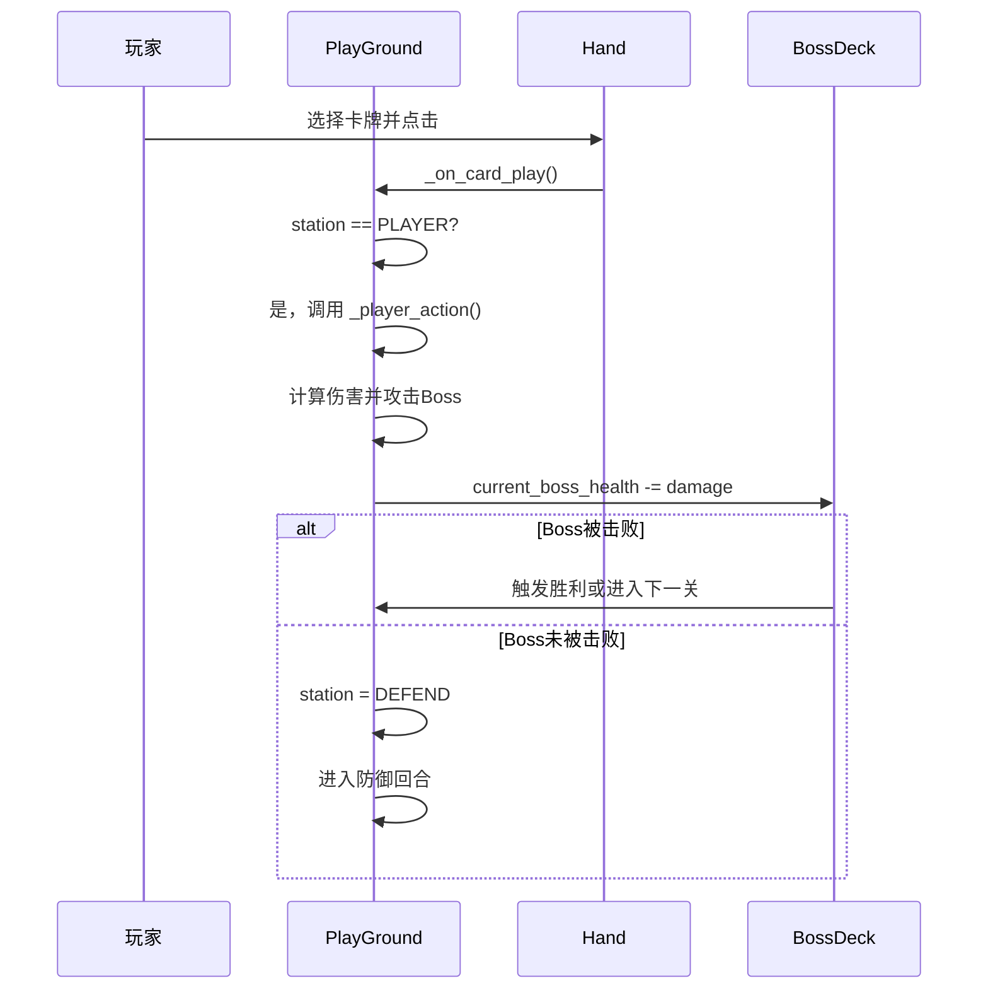
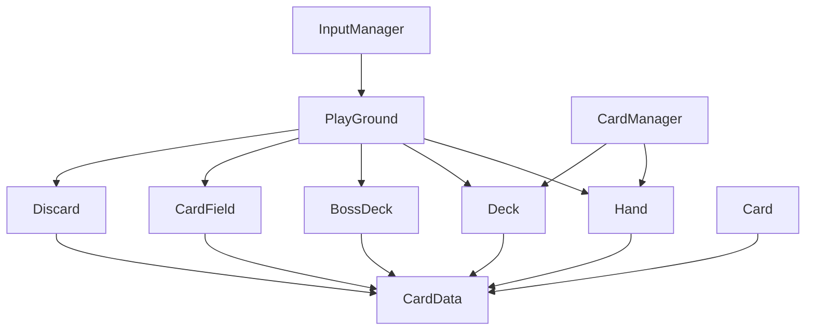

# 核心游戏系统

<cite>
**本文档引用的文件**  
- [play_ground.gd](file://scripts/play_ground.gd)
- [card_data.gd](file://scripts/card_data.gd)
- [deck.gd](file://scripts/deck.gd)
- [hand.gd](file://scripts/hand.gd)
- [boss_deck.gd](file://scripts/boss_deck.gd)
- [card.gd](file://scripts/card.gd)
- [card_manager.gd](file://scripts/card_manager.gd)
- [discard.gd](file://scripts/discard.gd)
- [card_field.gd](file://scripts/card_field.gd)
- [button.gd](file://scripts/button.gd)
- [input_manager.gd](file://scripts/input_manager.gd)
</cite>

## 目录
1. [简介](#简介)
2. [项目结构](#项目结构)
3. [核心组件](#核心组件)
4. [架构概览](#架构概览)
5. [详细组件分析](#详细组件分析)
6. [依赖分析](#依赖分析)
7. [性能考虑](#性能考虑)
8. [故障排除指南](#故障排除指南)
9. [结论](#结论)

## 简介
本文档深入分析基于Godot引擎的卡牌游戏“Regicide”的核心游戏系统，重点解析`PlayGround`脚本实现的游戏主控逻辑。文档将详细解释游戏初始化流程、状态机管理（如`TurnStation`枚举）、玩家与Boss回合切换机制，以及`PlayGround`如何协调`Deck`、`Hand`、`BossDeck`等组件完成发牌、出牌、攻击计算和胜利条件判定。同时，结合`card_data.gd`中的常量与枚举（如卡牌类型、效果类型）说明游戏规则的数据驱动设计，并提供关键函数调用流程的说明。此外，还将解释`CardData`作为Autoload单例的全局访问机制，以及常见问题的排查方法。

## 项目结构
项目采用模块化设计，核心逻辑分散在`scripts`目录下的多个GDScript文件中。主要组件包括`PlayGround`（游戏主控）、`CardData`（数据定义）、`Deck`（牌堆）、`Hand`（玩家手牌）、`BossDeck`（Boss管理）、`Card`（卡牌实体）等。这种结构清晰地分离了数据、逻辑和UI，便于维护和扩展。



**Diagram sources**
- [play_ground.gd](file://scripts/play_ground.gd#L2-L7)
- [card_data.gd](file://scripts/card_data.gd#L1-L72)
- [deck.gd](file://scripts/deck.gd#L1-L40)
- [hand.gd](file://scripts/hand.gd#L1-L68)
- [boss_deck.gd](file://scripts/boss_deck.gd#L1-L46)

**Section sources**
- [play_ground.gd](file://scripts/play_ground.gd#L1-L96)
- [scripts](file://scripts/)

## 核心组件
`PlayGround`是整个游戏的中央控制器，负责协调所有其他组件。它通过`@onready`变量引用`Hand`、`Deck`、`BossDeck`等关键节点，实现了对游戏流程的集中控制。游戏的核心状态由`station`变量管理，该变量使用`CardData.TurnStation`枚举来表示当前是玩家回合还是防御回合。

**Section sources**
- [play_ground.gd](file://scripts/play_ground.gd#L1-L96)
- [card_data.gd](file://scripts/card_data.gd#L36-L39)

## 架构概览
系统采用事件驱动和状态机相结合的架构。`PlayGround`作为协调者，监听来自`Hand`的出牌事件和来自`EndTurnButton`的回合结束事件。游戏状态在`PLAYER`和`DEFEND`之间切换，驱动不同的游戏逻辑。数据定义（`CardData`）被所有组件全局引用，确保了规则的一致性。



**Diagram sources**
- [play_ground.gd](file://scripts/play_ground.gd#L10)
- [card_data.gd](file://scripts/card_data.gd#L36-L39)

## 详细组件分析

### PlayGround主控逻辑分析
`PlayGround`脚本是游戏逻辑的核心，它管理着游戏的初始化、回合流程和胜负判定。

#### 游戏初始化流程
游戏启动时，`_ready()`函数调用`_start()`方法。该方法首先从`BossDeck`抽取一张Boss卡，设置当前Boss的生命值和攻击力，然后从`Deck`向`Hand`抽取`MAX_HAND_CARD_NUM`（7张）卡牌，完成初始发牌。



**Diagram sources**
- [play_ground.gd](file://scripts/play_ground.gd#L11-L24)
- [boss_deck.gd](file://scripts/boss_deck.gd#L34-L42)
- [deck.gd](file://scripts/deck.gd#L20-L31)

**Section sources**
- [play_ground.gd](file://scripts/play_ground.gd#L11-L24)

#### 状态机与回合切换机制
游戏状态由`station`变量精确控制，其类型为`CardData.TurnStation`枚举（`PLAYER`或`DEFEND`）。
- **玩家回合 (`PLAYER`)**：当玩家出牌时，触发`_on_card_play()`事件，进而调用`_player_action()`。此函数计算卡牌效果并攻击Boss。
- **防御回合 (`DEFEND`)**：当Boss攻击时，`station`被设置为`DEFEND`。玩家必须选择手牌进行防御，所选卡牌的总值必须大于等于Boss的攻击力。



**Diagram sources**
- [play_ground.gd](file://scripts/play_ground.gd#L17-L20)
- [play_ground.gd](file://scripts/play_ground.gd#L25-L30)
- [play_ground.gd](file://scripts/play_ground.gd#L69-L82)

**Section sources**
- [play_ground.gd](file://scripts/play_ground.gd#L10)
- [card_data.gd](file://scripts/card_data.gd#L36-L39)

#### 卡牌效果与战斗计算
`card_effect()`函数是战斗计算的核心。它遍历玩家出牌，计算总伤害，并根据花色触发特殊效果：
- **黑桃 (SPADE)**：减少Boss下一次攻击的伤害。
- **红心 (HEART)**：将弃牌堆的卡牌洗回主牌堆。
- **方块 (DIAMOND)**：从主牌堆抽牌。
- **梅花 (CLUB)**：伤害翻倍。

```mermaid
flowchart TD
A[开始 card_effect()] --> B[遍历出牌]
B --> C{花色是梅花?}
C --> |是| D[伤害翻倍]
C --> |否| E{花色是红心?}
E --> |是| F[从弃牌堆拿卡]
E --> |否| G{花色是方块?}
G --> |是| H[从主牌堆抽卡]
G --> |否| I{花色是黑桃?}
I --> |是| J[减少Boss攻击]
I --> |否| K[累加卡牌点数]
K --> L[计算总伤害]
L --> M[对Boss造成伤害]
M --> N{Boss生命值<=0?}
N --> |是| O[判定胜利或进入下一关]
N --> |否| P[进入防御回合]
```

**Diagram sources**
- [play_ground.gd](file://scripts/play_ground.gd#L30-L60)

**Section sources**
- [play_ground.gd](file://scripts/play_ground.gd#L30-L60)
- [card_data.gd](file://scripts/card_data.gd#L14-L18)

### CardData数据驱动设计分析
`CardData`脚本是整个游戏的数据中心，它定义了所有游戏规则的常量和枚举，实现了数据驱动的设计。

#### 枚举与常量定义
`CardData`定义了多个关键枚举和常量：
- **CardNum**: 卡牌点数 (ACE 到 TEN)
- **Suit**: 花色 (SPADE, DIAMOND, HEART, CLUB)
- **Boss**: Boss等级 (JACK, QUEEN, KING)
- **CardPosition**: 卡牌位置 (DECK, HAND, FIELD, BOSS, DISCARD)
- **TurnStation**: 游戏状态 (PLAYER, DEFEND)
- **常量**: 如`MAX_HAND_CARD_NUM`（最大手牌数）、`CARD_SUM_MAX`（出牌点数上限）等。

#### 全局访问机制
`CardData`被设计为一个Autoload单例（虽然代码中未明确设置，但其被广泛引用的模式符合单例特征），所有其他脚本通过`CardData.常量名`或`CardData.枚举名`的方式直接访问其数据，确保了规则的统一性和可维护性。

**Section sources**
- [card_data.gd](file://scripts/card_data.gd#L2-L58)

### 其他核心组件分析
#### Deck与Hand组件
`Deck`管理主牌堆，负责发牌和回收卡牌。`Hand`管理玩家手牌，处理卡牌的添加、移除和位置更新。`Hand`的`update_position()`方法会根据当前`station`和`selected_cards`动态计算卡牌位置和禁用状态，以实现交互反馈。

**Section sources**
- [deck.gd](file://scripts/deck.gd#L1-L40)
- [hand.gd](file://scripts/hand.gd#L1-L68)

#### BossDeck与战斗状态
`BossDeck`管理Boss序列，`current_boss()`返回当前Boss，`refresh_status()`同步更新UI上的生命值和攻击力。`draw_card()`用于进入下一关。

**Section sources**
- [boss_deck.gd](file://scripts/boss_deck.gd#L1-L46)

## 依赖分析
系统组件间存在清晰的依赖关系。`PlayGround`是顶层协调者，强依赖于`Hand`、`Deck`、`BossDeck`等。`Card`类是基础实体，被所有容器组件（`Deck`、`Hand`等）持有。`CardData`作为数据源，被几乎所有脚本依赖。`CardManager`负责全局的卡牌交互事件分发。



**Diagram sources**
- [play_ground.gd](file://scripts/play_ground.gd#L2-L7)
- [hand.gd](file://scripts/hand.gd#L5)
- [card.gd](file://scripts/card.gd#L22)

**Section sources**
- [play_ground.gd](file://scripts/play_ground.gd#L2-L7)
- [hand.gd](file://scripts/hand.gd#L5)
- [card.gd](file://scripts/card.gd#L22)

## 性能考虑
游戏逻辑主要在回合切换和卡牌交互时执行，计算量较小。动画使用`Tween`实现平滑移动，性能开销可控。`shuffle()`操作在牌堆初始化和从弃牌堆取卡时发生，由于牌堆规模不大，不会造成性能瓶颈。整体设计轻量，适合2D卡牌游戏。

## 故障排除指南
### 状态同步错误
**现象**：UI显示的状态与实际游戏逻辑不符。
**排查**：
1. 检查`station`变量的赋值时机是否正确，确保在`boss_attack()`中正确设置为`DEFEND`。
2. 检查`refresh_status()`是否在Boss状态变化后被调用。
3. 使用`print()`语句输出`station`和`current_boss_health`等关键变量的值，验证状态流转。

### 回合逻辑异常
**现象**：无法出牌或防御判定错误。
**排查**：
1. 检查`Hand`的`station`属性是否与`PlayGround`的`station`同步。
2. 检查`CardData.isValidCards()`函数的逻辑，确保出牌规则（点数相同且总和不超过上限）正确实现。
3. 检查`boss_attack()`中的防御循环，确保`await end_turn_button_ref.pressed`能正确捕获玩家确认操作。

**Section sources**
- [play_ground.gd](file://scripts/play_ground.gd#L10)
- [hand.gd](file://scripts/hand.gd#L5)
- [card_data.gd](file://scripts/card_data.gd#L59-L68)

## 结论
本项目通过`PlayGround`脚本实现了清晰的游戏主控逻辑，利用状态机管理回合流程，并通过`CardData`实现了数据驱动的设计。各组件职责分明，通过事件和直接引用进行通信，架构合理。理解`PlayGround`中的`card_effect()`和`boss_attack()`函数，以及`CardData`中的规则定义，是掌握整个游戏系统的关键。对于状态同步和回合逻辑问题，应重点检查状态变量的赋值和事件触发的时机。