# 牌堆系统

<cite>
**本文档中引用的文件**
- [deck.gd](file://scripts/deck.gd)
- [discard.gd](file://scripts/discard.gd)
- [boss_deck.gd](file://scripts/boss_deck.gd)
- [card.gd](file://scripts/card.gd)
- [hand.gd](file://scripts/hand.gd)
- [card_manager.gd](file://scripts/card_manager.gd)
- [play_ground.gd](file://scripts/play_ground.gd)
- [card_data.gd](file://scripts/card_data.gd)
</cite>

## 目录
1. [简介](#简介)
2. [系统架构概览](#系统架构概览)
3. [主牌堆系统（Deck）](#主牌堆系统deck)
4. [弃牌堆系统（Discard）](#弃牌堆系统discard)
5. [老板牌堆系统（BossDeck）](#老板牌堆系统bossdeck)
6. [牌堆间的协作机制](#牌堆间的协作机制)
7. [洗牌算法与抽牌逻辑](#洗牌算法与抽牌逻辑)
8. [性能优化与内存管理](#性能优化与内存管理)
9. [错误处理与状态管理](#错误处理与状态管理)
10. [总结](#总结)

## 简介

Regicide游戏的牌堆系统是一个复杂而精密的卡片管理系统，负责维护游戏中的四种主要牌堆：主牌堆（Deck）、弃牌堆（Discard）、老板牌堆（BossDeck）和手牌堆（Hand）。该系统采用面向对象的设计模式，通过Godot引擎的节点树结构实现了牌堆之间的协调工作。

系统的核心设计理念是分离关注点，每个牌堆组件都有明确的职责：
- **Deck**：负责新游戏开始时的牌组初始化和抽牌操作
- **Discard**：管理已使用卡片的回收和重新洗牌
- **BossDeck**：专门处理老板关卡的特殊牌组逻辑
- **Hand**：管理玩家手中的可操作卡片

## 系统架构概览

牌堆系统采用分层架构设计，通过信号和方法调用实现组件间的通信。

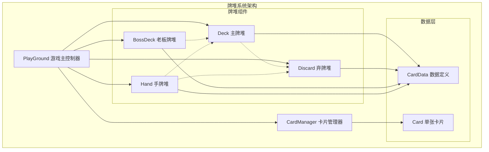

**图表来源**
- [play_ground.gd](file://scripts/play_ground.gd#L1-L96)
- [deck.gd](file://scripts/deck.gd#L1-L40)
- [discard.gd](file://scripts/discard.gd#L1-L23)
- [boss_deck.gd](file://scripts/boss_deck.gd#L1-L46)

**章节来源**
- [play_ground.gd](file://scripts/play_ground.gd#L1-L96)
- [card_data.gd](file://scripts/card_data.gd#L1-L72)

## 主牌堆系统（Deck）

主牌堆是游戏的基础牌源，负责在游戏开始时初始化完整的牌组，并提供抽牌功能。

### 核心功能特性

主牌堆系统具有以下核心功能：

1. **牌组初始化**：在游戏开始时创建完整的52张牌组
2. **抽牌操作**：从牌堆顶部抽取指定数量的卡片
3. **牌堆状态监控**：实时更新牌堆可见性状态
4. **老板牌插入**：支持将老板牌插入到牌堆顶部

### 牌组初始化机制

主牌堆采用双重循环结构进行牌组初始化：

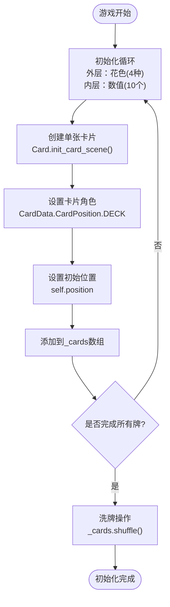

**图表来源**
- [deck.gd](file://scripts/deck.gd#L8-L15)

### 抽牌逻辑实现

抽牌操作是主牌堆的核心功能，采用异步处理确保动画效果：

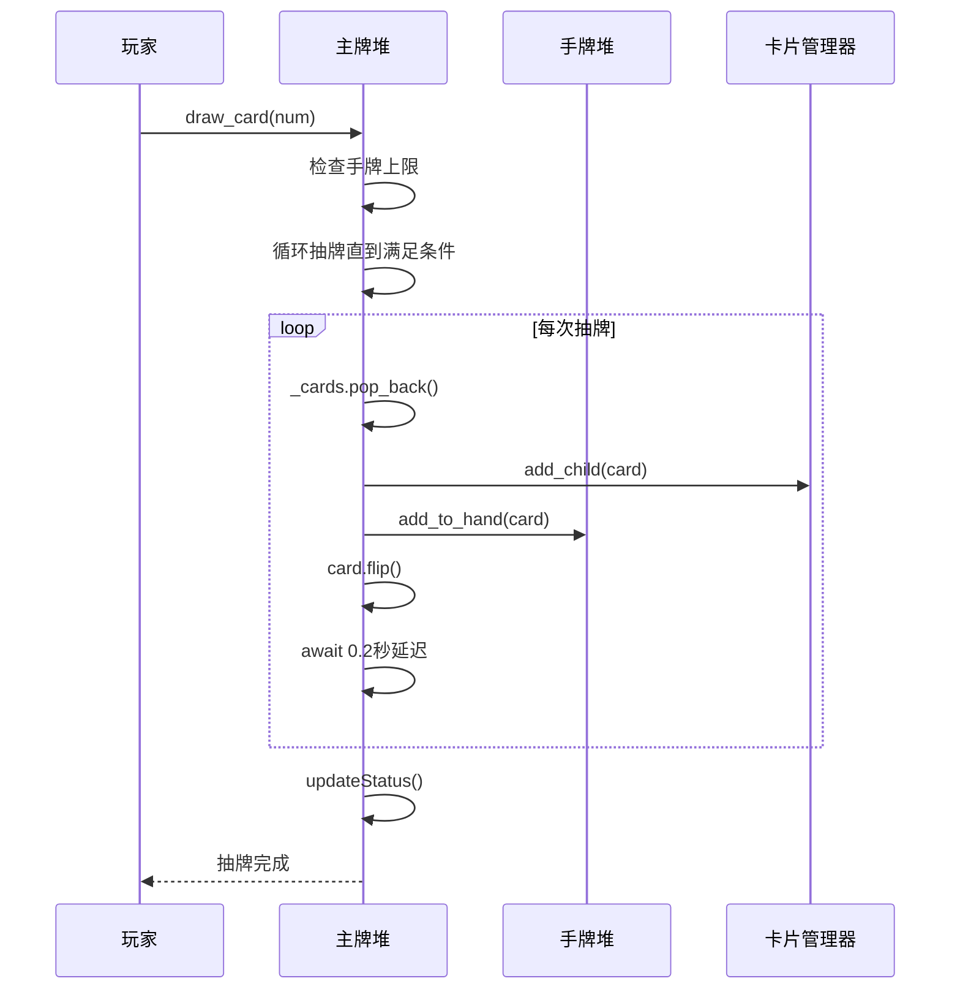

**图表来源**
- [deck.gd](file://scripts/deck.gd#L20-L31)

### 关键方法详解

#### draw_card() 方法
- **功能**：从牌堆顶部抽取指定数量的卡片
- **参数**：num（抽牌数量，默认为1）
- **返回值**：无
- **实现细节**：检查手牌上限，逐张抽取并添加到手牌堆

#### put_boss_top() 方法  
- **功能**：将老板牌插入到牌堆顶部
- **参数**：card（要插入的老板牌）
- **返回值**：无
- **用途**：用于老板胜利时将老板牌放回牌堆顶部

#### put_cards_back() 方法
- **功能**：将一组卡片放回牌堆
- **参数**：cards（要放回的卡片数组）
- **返回值**：无
- **实现**：将新卡片数组与现有牌堆合并

**章节来源**
- [deck.gd](file://scripts/deck.gd#L1-L40)

## 弃牌堆系统（Discard）

弃牌堆负责管理游戏中被使用的卡片，提供回收利用和重新洗牌的功能。

### 核心设计原则

弃牌堆采用简单而高效的设计原则：

1. **卡片回收**：收集所有被使用的卡片
2. **随机重洗**：支持对弃牌进行随机化处理
3. **批量获取**：提供批量获取弃牌的功能
4. **位置重置**：支持卡片位置的重新定位

### 弃牌管理流程

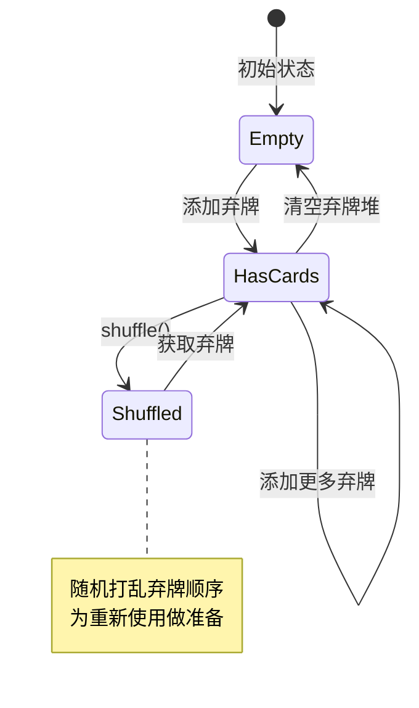

**图表来源**
- [discard.gd](file://scripts/discard.gd#L12-L16)

### 关键方法实现

#### getCards() 方法
- **功能**：从弃牌堆中获取指定数量的卡片
- **参数**：num（获取数量，默认为1）
- **返回值**：Array[Card]（获取的卡片数组）
- **实现逻辑**：
  - 对弃牌堆进行随机排序
  - 截取前num张卡片
  - 将剩余卡片重新赋值给cards数组

#### fresh_pos() 方法
- **功能**：重置弃牌的位置和角色
- **参数**：无
- **返回值**：无
- **实现细节**：遍历所有弃牌，设置角色为DISCARD并移动到弃牌堆位置

**章节来源**
- [discard.gd](file://scripts/discard.gd#L1-L23)

## 老板牌堆系统（BossDeck）

老板牌堆是游戏的独特创新，专门处理老板关卡的特殊需求。

### 老板牌堆特性

老板牌堆具有以下特殊特性：

1. **三层结构**：按难度递增排列的三组老板牌
2. **动态生成**：根据当前关卡动态选择老板牌
3. **生命值管理**：自动计算和更新老板的生命值和攻击力
4. **阶段切换**：支持老板牌之间的平滑过渡

### 老板牌生成机制

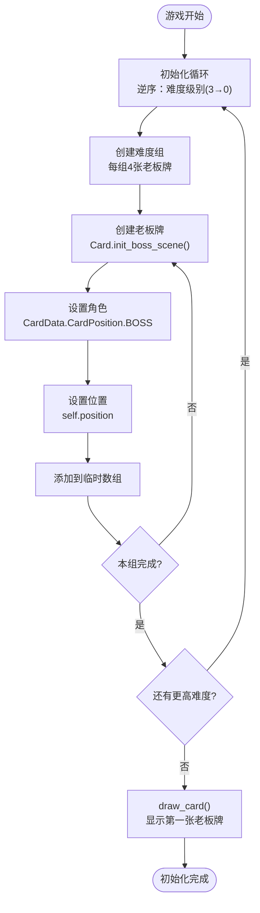

**图表来源**
- [boss_deck.gd](file://scripts/boss_deck.gd#L16-L25)

### 生命值与攻击力计算

老板牌的生命值和攻击力基于其数值自动计算：

| 老板牌类型 | 数值 | 基础生命值 | 基础攻击力 |
|-----------|------|-----------|-----------|
| Jack | 10 | 20 | 10 |
| Queen | 15 | 30 | 15 |
| King | 20 | 40 | 20 |

### 关键方法详解

#### draw_card() 方法
- **功能**：抽取当前老板牌并更新状态
- **参数**：无
- **返回值**：无
- **实现步骤**：
  1. 检查牌堆是否为空
  2. 获取最后一张卡片作为当前老板牌
  3. 计算生命值（数值×2）和攻击力
  4. 翻转卡片显示
  5. 添加到卡片管理器
  6. 更新状态显示

#### refresh_status() 方法
- **功能**：刷新老板牌的生命值和攻击力显示
- **参数**：无
- **返回值**：无
- **实现细节**：格式化显示文本，包含当前值和最大值

**章节来源**
- [boss_deck.gd](file://scripts/boss_deck.gd#L1-L46)

## 牌堆间的协作机制

牌堆系统通过PlayGround主控制器实现组件间的协调工作。

### 协作关系图

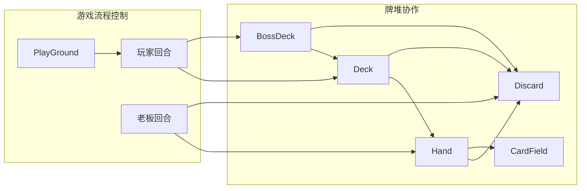

**图表来源**
- [play_ground.gd](file://scripts/play_ground.gd#L1-L96)

### 信号与事件处理

牌堆系统通过Godot的信号机制实现松耦合的组件通信：

1. **抽牌信号**：Deck → Hand → CardManager
2. **弃牌信号**：Hand → Discard → CardManager  
3. **老板牌信号**：BossDeck → Deck → PlayGround
4. **手牌变化信号**：Hand → PlayGround → CardData

### 协作流程示例

#### 玩家出牌流程
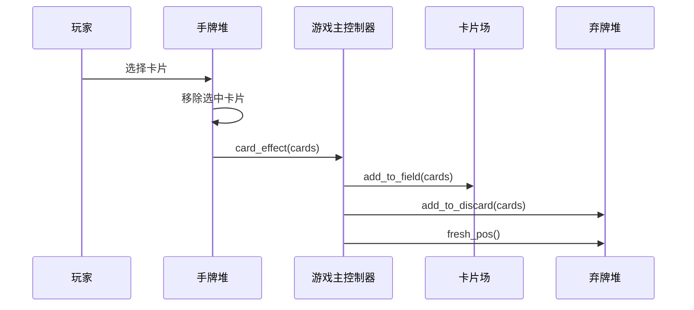

**图表来源**
- [play_ground.gd](file://scripts/play_ground.gd#L29-L67)

**章节来源**
- [play_ground.gd](file://scripts/play_ground.gd#L1-L96)

## 洗牌算法与抽牌逻辑

### 洗牌算法实现

Godot引擎提供了内置的shuffle()方法，这是一个高质量的随机化算法：

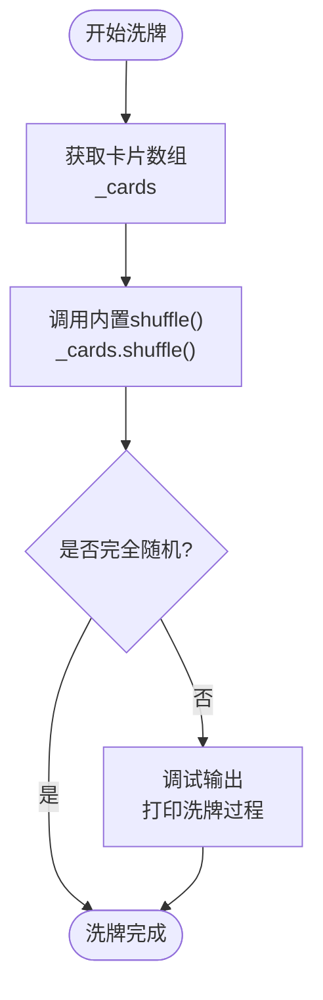

**图表来源**
- [deck.gd](file://scripts/deck.gd#L15)

### 抽牌逻辑优化

抽牌操作采用了多项优化策略：

1. **异步处理**：使用await和定时器实现抽牌动画
2. **边界检查**：防止手牌超出上限
3. **状态同步**：及时更新牌堆状态显示
4. **资源管理**：避免重复创建卡片实例

### 牌堆空时处理策略

当牌堆为空时，系统采用以下策略：

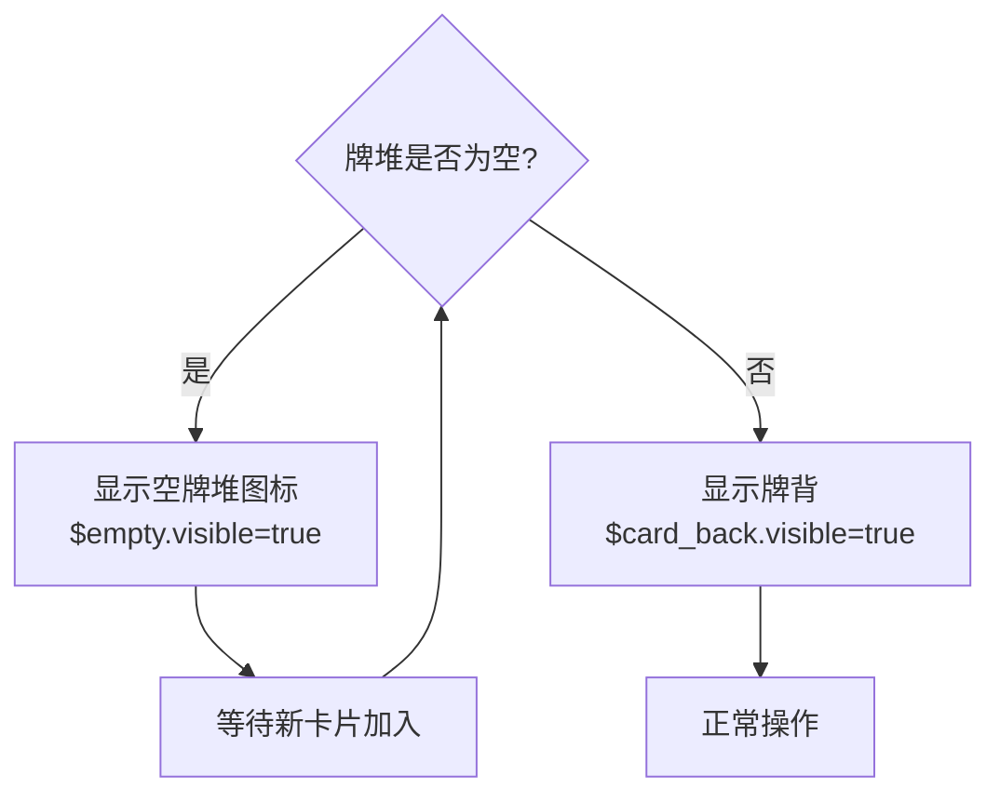

**图表来源**
- [deck.gd](file://scripts/deck.gd#L38-L39)

**章节来源**
- [deck.gd](file://scripts/deck.gd#L20-L31)

## 性能优化与内存管理

### 内存管理策略

牌堆系统采用了多种内存管理优化：

1. **对象池模式**：重用卡片对象而非频繁创建销毁
2. **延迟加载**：卡片仅在需要时才实例化
3. **垃圾回收友好**：及时断开不必要的引用关系
4. **批量操作**：减少频繁的单个卡片操作

### 性能优化技术

#### 异步抽牌动画
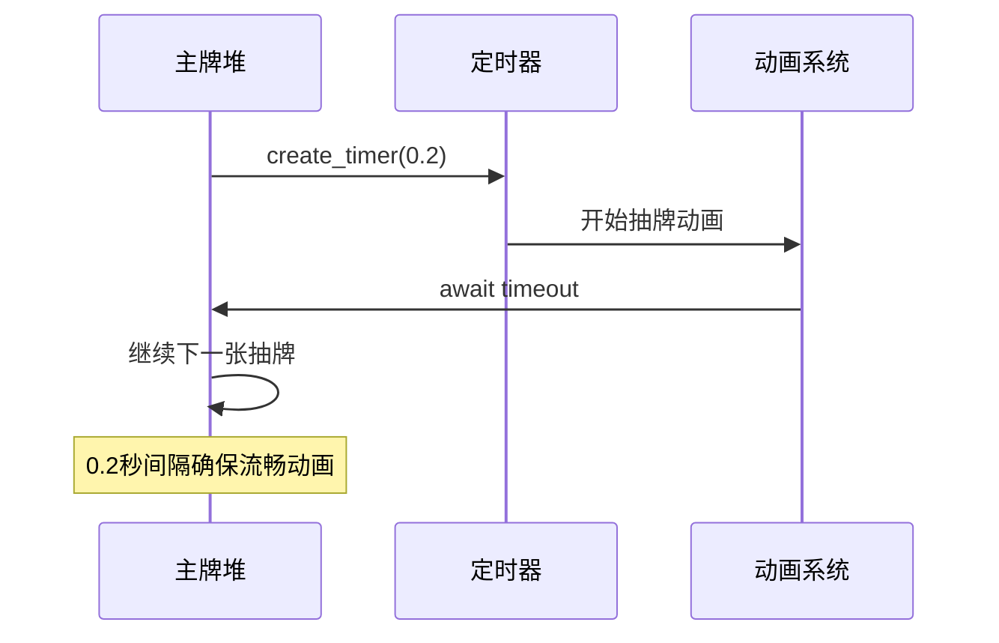

#### 批量弃牌处理
弃牌系统支持批量操作以提高性能：
- 使用slice()方法进行高效的数组分割
- 避免频繁的push/pop操作
- 利用Godot的内置函数优化数组处理

### 大量卡片操作的优化

对于大量卡片操作，系统采用了以下优化措施：

1. **分帧处理**：将大量操作分散到多个帧执行
2. **缓存机制**：缓存常用的计算结果
3. **懒加载**：仅在需要时加载卡片资源
4. **内存池**：重用卡片对象减少GC压力

**章节来源**
- [deck.gd](file://scripts/deck.gd#L20-L31)
- [discard.gd](file://scripts/discard.gd#L12-L16)

## 错误处理与状态管理

### 状态一致性保证

牌堆系统通过多重机制确保状态的一致性：

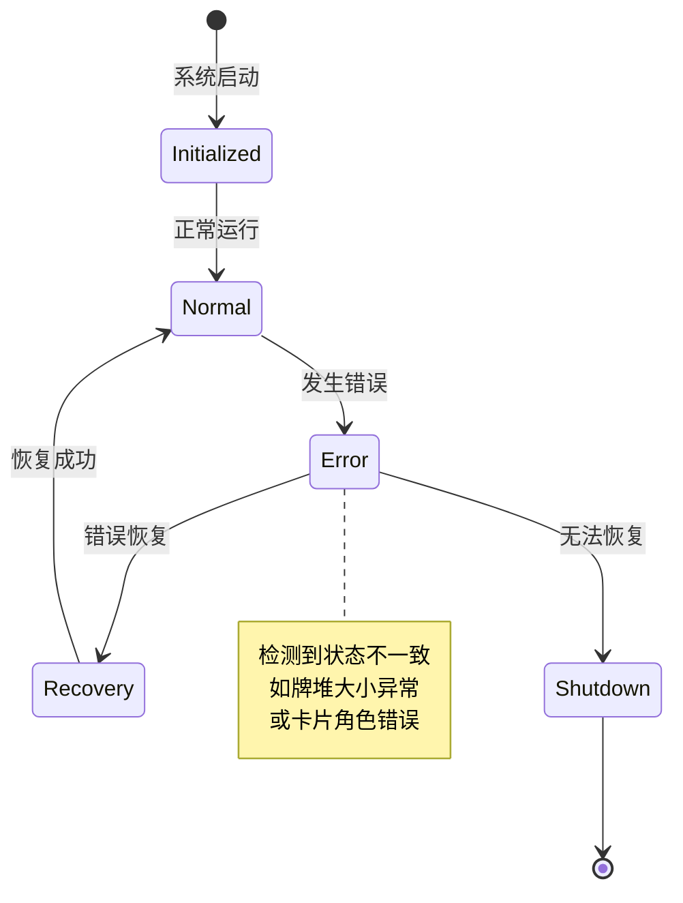

### 常见错误场景与解决方案

#### 牌堆状态错误
- **问题**：牌堆大小与实际卡片数量不匹配
- **检测**：updateStatus()方法实时验证
- **修复**：重新计算并同步状态

#### 卡片角色错误
- **问题**：卡片角色与实际位置不符
- **检测**：CardData.CardPosition枚举验证
- **修复**：强制设置正确的角色

#### 抽牌超限错误
- **问题**：尝试抽取超过手牌上限的卡片
- **检测**：hand_ref.card_size检查
- **修复**：限制抽取数量至允许范围

### 错误恢复机制

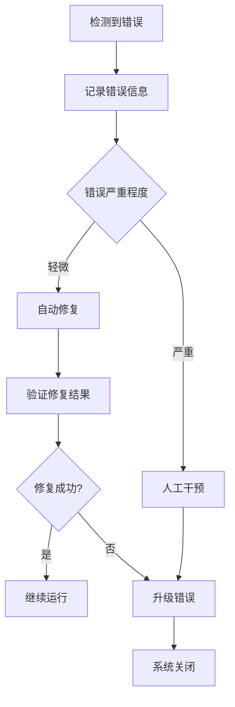

### 调试与监控

系统提供了完善的调试和监控功能：

1. **状态监控**：实时显示各牌堆的状态
2. **日志记录**：记录重要的操作和错误信息
3. **性能计数器**：跟踪关键操作的执行时间
4. **内存使用监控**：监控内存分配和释放

**章节来源**
- [deck.gd](file://scripts/deck.gd#L38-L39)
- [play_ground.gd](file://scripts/play_ground.gd#L89-L96)

## 总结

Regicide的牌堆系统展现了优秀的软件架构设计，通过模块化和分层的方式实现了复杂的卡片管理功能。系统的主要优势包括：

### 设计优势
1. **清晰的职责分离**：每个牌堆组件都有明确的职责边界
2. **灵活的扩展性**：新的牌堆类型可以轻松集成
3. **良好的性能表现**：通过优化算法和异步处理确保流畅体验
4. **强大的错误处理**：多层次的错误检测和恢复机制

### 技术亮点
1. **Godot引擎集成**：充分利用Godot的节点系统和信号机制
2. **面向对象设计**：清晰的类层次结构和继承关系
3. **异步编程**：使用await实现流畅的动画效果
4. **内存优化**：通过对象重用和批量操作优化性能

### 应用价值
该牌堆系统不仅适用于Regicide游戏，其设计理念和实现方式也为其他卡牌类游戏提供了宝贵的参考。系统的模块化设计使得它能够适应不同的游戏需求，而完善的错误处理机制则确保了系统的稳定性和可靠性。

通过深入分析这个牌堆系统，我们可以看到优秀的软件设计如何将复杂的游戏逻辑分解为可管理的组件，同时保持系统的灵活性和可维护性。这种设计思路对于开发大型游戏项目具有重要的指导意义。