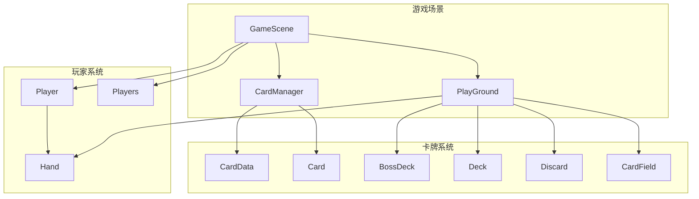
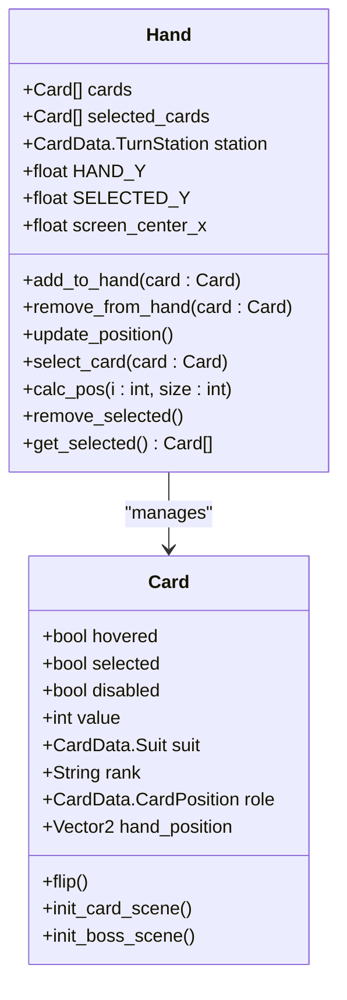
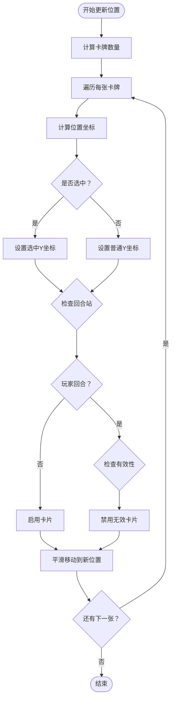
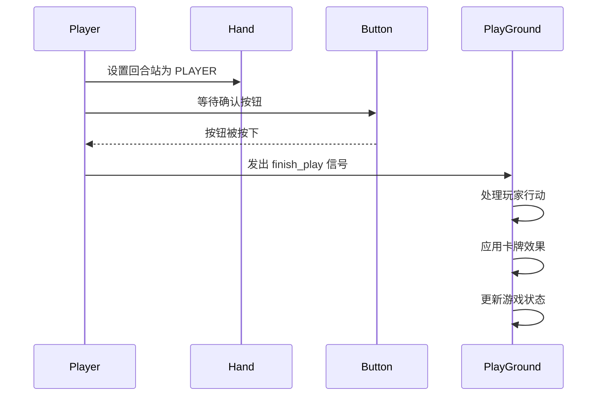
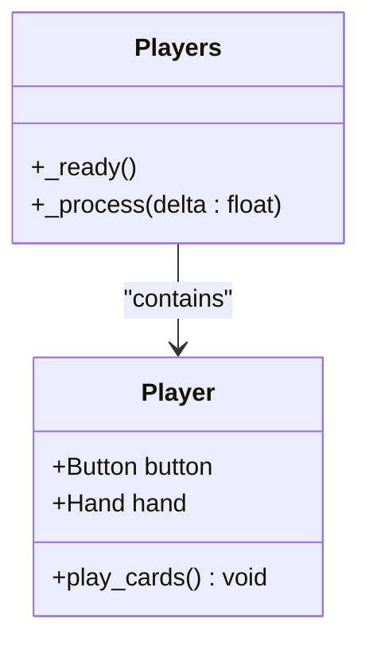
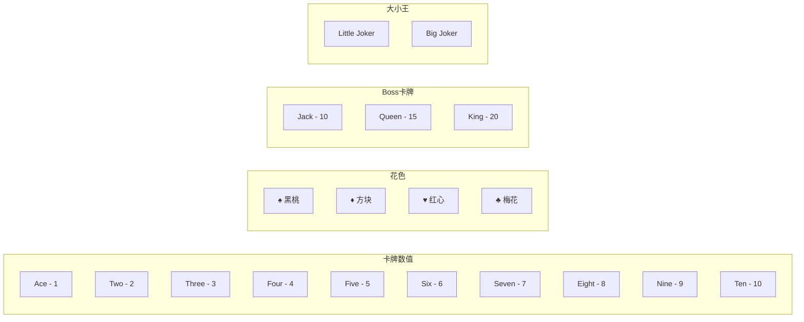
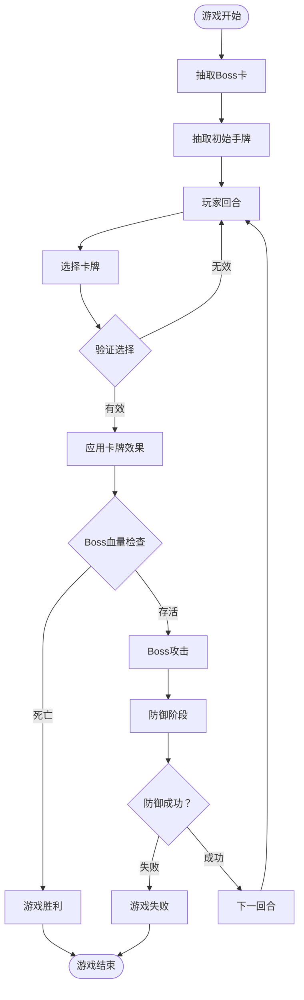
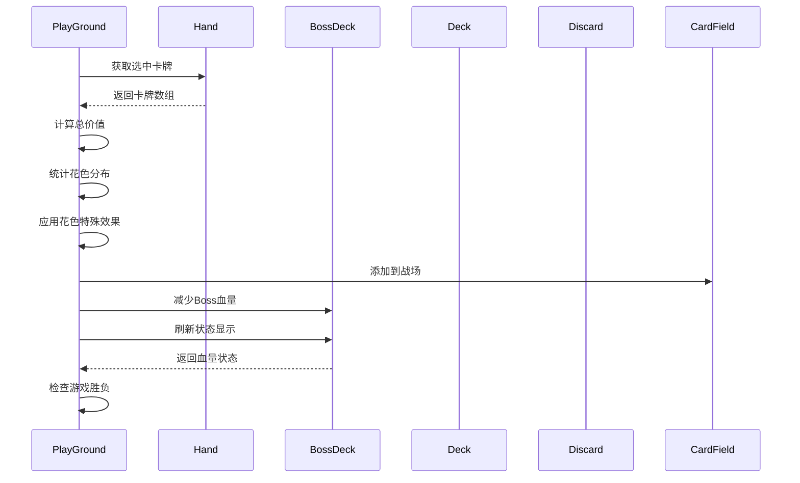
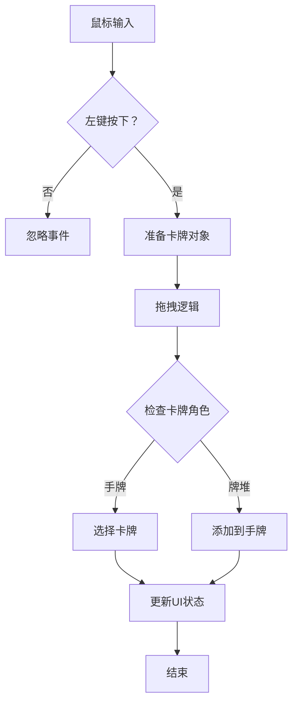

# 玩家系统

<cite>
**本文档引用的文件**
- [hand.gd](file://scripts/hand.gd)
- [player.gd](file://scripts/player.gd)
- [players.gd](file://scripts/players.gd)
- [card_data.gd](file://scripts/card_data.gd)
- [card.gd](file://scripts/card.gd)
- [play_ground.gd](file://scripts/play_ground.gd)
- [card_manager.gd](file://scripts/card_manager.gd)
- [game_scene.tscn](file://scenes/game_scene.tscn)
- [player.tscn](file://scenes/player.tscn)
</cite>

## 目录
1. [简介](#简介)
2. [系统架构概览](#系统架构概览)
3. [手牌管理系统（Hand）](#手牌管理系统hand)
4. [玩家状态管理（Player）](#玩家状态管理player)
5. [多玩家控制（Players）](#多玩家控制players)
6. [卡牌数据模型](#卡牌数据模型)
7. [游戏流程与交互](#游戏流程与交互)
8. [UI同步机制](#ui同步机制)
9. [问题诊断与解决方案](#问题诊断与解决方案)
10. [总结](#总结)

## 简介

Regicide游戏的玩家系统是一个复杂而精密的状态管理框架，负责处理玩家的手牌、状态和多玩家交互。该系统通过三个核心组件：手牌管理（Hand）、玩家状态（Player）和多玩家控制（Players），实现了完整的回合制卡牌游戏逻辑。

系统的核心设计理念是模块化和可扩展性，每个组件都有明确的职责分工：
- **Hand组件**：负责手牌的物理布局、视觉效果和用户交互
- **Player组件**：管理玩家的基本状态和回合操作
- **Players组件**：协调多个玩家之间的切换和数据隔离

## 系统架构概览



**图表来源**
- [game_scene.tscn](file://scenes/game_scene.tscn#L1-L45)
- [player.tscn](file://scenes/player.tscn#L1-L21)

**章节来源**
- [game_scene.tscn](file://scenes/game_scene.tscn#L1-L45)
- [player.tscn](file://scenes/player.tscn#L1-L21)

## 手牌管理系统（Hand）

Hand组件是玩家系统的核心视觉和交互层，负责管理玩家当前持有的卡牌集合，包括添加、移除、布局更新和交互反馈。

### 核心功能架构



**图表来源**
- [hand.gd](file://scripts/hand.gd#L1-L68)
- [card.gd](file://scripts/card.gd#L1-L67)

### 手牌布局算法

Hand组件使用智能布局算法来管理卡牌的视觉排列：



**图表来源**
- [hand.gd](file://scripts/hand.gd#L37-L47)

### 卡牌选择机制

手牌系统支持复杂的卡牌选择和验证逻辑：

| 功能 | 描述 | 实现方式 |
|------|------|----------|
| 单选模式 | 允许单张卡牌选择 | `select_card()` 方法 |
| 多选验证 | 验证组合的有效性 | `CardData.isValidCards()` |
| 状态同步 | 同步选中状态到数组 | `selected_cards = cards.filter()` |
| 视觉反馈 | 显示选中和禁用状态 | `card.selected` 和 `card.disabled` |
| 布局调整 | 自动重新排列卡牌 | `update_position()` |

**章节来源**
- [hand.gd](file://scripts/hand.gd#L1-L68)

## 玩家状态管理（Player）

Player组件负责管理玩家的基本状态和回合操作，是连接手牌系统和游戏流程的桥梁。

### 玩家状态架构



**图表来源**
- [player.gd](file://scripts/player.gd#L1-L19)
- [play_ground.gd](file://scripts/play_ground.gd#L17-L20)

### 回合操作流程

Player组件定义了标准的回合操作流程：

1. **回合开始**：设置回合站为 PLAYER
2. **等待确认**：等待玩家点击确认按钮
3. **行动执行**：移除已选卡牌并应用效果
4. **状态更新**：触发完成信号通知游戏流程

**章节来源**
- [player.gd](file://scripts/player.gd#L1-L19)

## 多玩家控制（Players）

Players组件虽然目前实现较为简单，但为未来的多玩家功能预留了扩展空间。

### 当前实现

Players组件目前主要作为容器节点存在，负责组织和管理多个玩家实例：



**图表来源**
- [players.gd](file://scripts/players.gd#L1-L12)

**章节来源**
- [players.gd](file://scripts/players.gd#L1-L12)

## 卡牌数据模型

CardData组件提供了完整的卡牌类型和游戏规则定义，是整个玩家系统的基础数据层。

### 卡牌类型系统



**图表来源**
- [card_data.gd](file://scripts/card_data.gd#L2-L28)

### 游戏规则定义

| 规则项 | 数值 | 描述 |
|--------|------|------|
| 最大手牌数 | 7 | 玩家手牌上限 |
| 卡牌总和上限 | 10 | 可以打出的卡牌总和 |
| 黑桃效果 | 倍增伤害 | 攻击Boss时造成双倍伤害 |
| 红心效果 | 恢复牌堆 | 将弃牌堆恢复到牌堆 |
| 方块效果 | 抽牌 | 从牌堆额外抽牌 |
| 梅花效果 | 双倍伤害 | 攻击时造成双倍伤害 |

**章节来源**
- [card_data.gd](file://scripts/card_data.gd#L1-L72)

## 游戏流程与交互

PlayGround组件是游戏流程的核心控制器，负责协调各个组件之间的交互。

### 主要游戏流程



**图表来源**
- [play_ground.gd](file://scripts/play_ground.gd#L21-L96)

### 卡牌效果计算

游戏中的卡牌效果计算遵循严格的数学规则：



**图表来源**
- [play_ground.gd](file://scripts/play_ground.gd#L30-L58)

**章节来源**
- [play_ground.gd](file://scripts/play_ground.gd#L1-L96)

## UI同步机制

CardManager组件负责处理用户界面的实时同步和交互响应。

### 事件处理流程



**图表来源**
- [card_manager.gd](file://scripts/card_manager.gd#L9-L23)

### 卡牌悬停检测

系统使用物理查询来精确检测鼠标悬停的卡牌：

| 检测要素 | 实现方式 | 用途 |
|----------|----------|------|
| 物理查询 | `PhysicsPointQueryParameters2D` | 精确检测鼠标位置 |
| 层级判断 | `z_index` 比较 | 确定最上层的卡牌 |
| 碰撞掩码 | `CardData.CARD_COLLISION_MASK` | 过滤无关物体 |
| 高度优先 | `highest card` 算法 | 处理重叠情况 |

**章节来源**
- [card_manager.gd](file://scripts/card_manager.gd#L1-L85)

## 问题诊断与解决方案

### 常见手牌显示异常

**症状**：手牌位置错乱、卡牌重叠或消失

**诊断步骤**：
1. 检查 `cards` 数组是否正确更新
2. 验证 `update_position()` 调用频率
3. 确认 `calc_pos()` 计算逻辑
4. 检查 `smooth_move()` 动画是否完成

**解决方案**：
```gdscript
# 在 hand.gd 中添加调试输出
func update_position() -> void:
    print("Updating positions for %d cards" % cards.size())
    for i in range(cards.size()):
        var card = cards[i]
        print("Card %d position: %s" % [i, str(card.position)])
```

### 玩家状态不同步

**症状**：回合状态混乱、按钮响应异常

**诊断步骤**：
1. 检查 `station` 状态变量
2. 验证信号连接是否正确
3. 确认 `_ready()` 初始化顺序

**解决方案**：
```gdscript
# 在 player.gd 中添加状态验证
func play_cards() -> void:
    assert(station == CardData.TurnStation.PLAYER, "Invalid station state")
    await button.pressed
    assert(station == CardData.TurnStation.DEFEND, "Unexpected station state")
```

### 卡牌限制失效

**症状**：可以打出超过限制的卡牌组合

**诊断步骤**：
1. 检查 `CardData.isValidCards()` 参数传递
2. 验证 `CARD_SUM_MAX` 常量定义
3. 确认 `reduce()` 函数调用

**解决方案**：
```gdscript
# 在 hand.gd 中添加验证逻辑
func select_card(card: Card) -> void:
    if station == CardData.TurnStation.DEFEND:
        card.selected = not card.selected
        selected_cards = cards.filter(func(c: Card): return c.selected)
        update_position()
    elif card.selected or CardData.isValidCards(selected_cards, card):
        card.selected = not card.selected
        selected_cards = cards.filter(func(c: Card): return c.selected)
        update_position()
```

### 性能优化建议

1. **减少不必要的重绘**：只在必要时调用 `update_position()`
2. **优化动画性能**：使用 `Tween` 替代逐帧动画
3. **内存管理**：及时清理不需要的卡牌引用
4. **批量操作**：合并多个状态变更操作

## 总结

Regicide的玩家系统展现了优秀的软件架构设计，通过模块化的方式实现了复杂的游戏逻辑。系统的主要优势包括：

1. **清晰的职责分离**：Hand、Player、Players各司其职，便于维护和扩展
2. **强类型约束**：使用枚举和类型注解确保数据一致性
3. **事件驱动架构**：通过信号和回调实现松耦合的组件通信
4. **完善的错误处理**：包含状态验证和边界条件检查

该系统为卡牌游戏开发提供了良好的参考模板，特别是在手牌管理和状态同步方面具有很高的实用价值。随着游戏功能的扩展，系统的设计能够很好地适应新的需求变化。