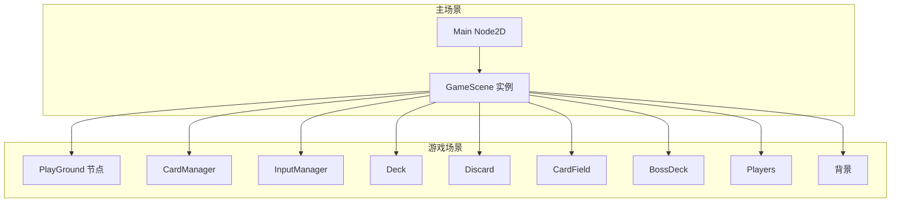
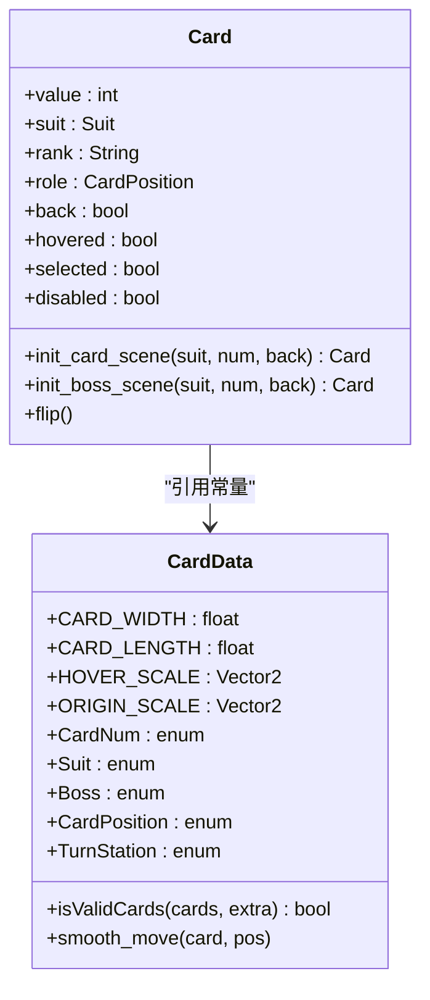
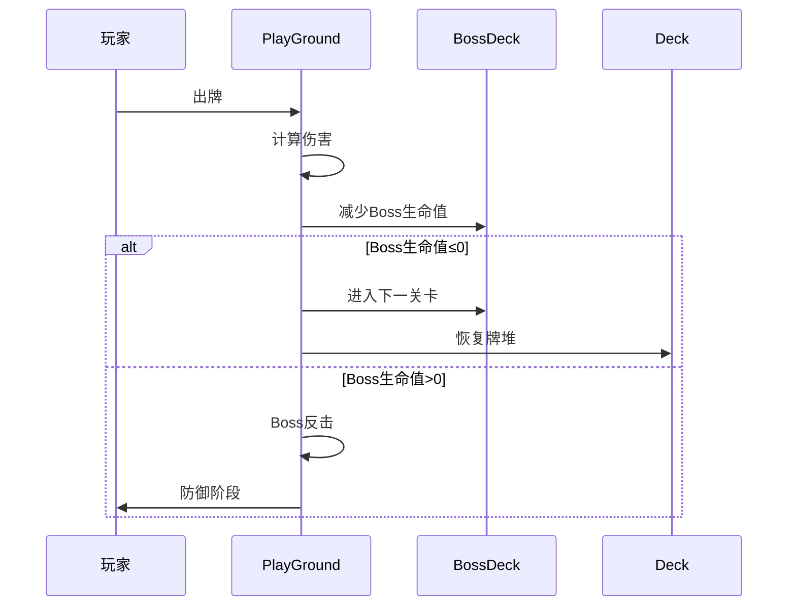
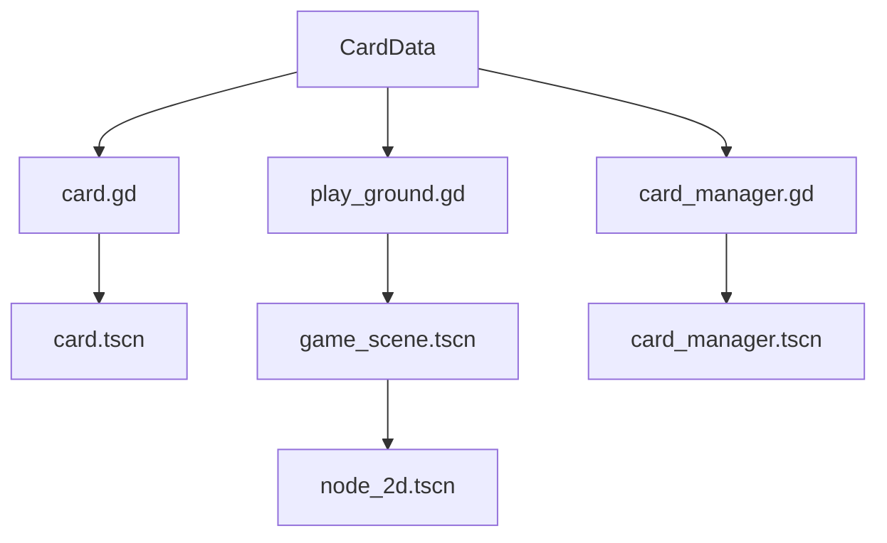

# 项目概述

<cite>
**本文档中引用的文件**  
- [project.godot](file://project.godot)
- [node_2d.tscn](file://scenes/node_2d.tscn)
- [game_scene.tscn](file://scenes/game_scene.tscn)
- [card.gd](file://scripts/card.gd)
- [card_data.gd](file://scripts/card_data.gd)
- [play_ground.gd](file://scripts/play_ground.gd)
- [card_manager.gd](file://scripts/card_manager.gd)
- [THIRDPARTY.md](file://addons/godot-git-plugin/THIRDPARTY.md)
</cite>

## 目录
1. [简介](#简介)
2. [项目结构](#项目结构)
3. [核心组件](#核心组件)
4. [架构概览](#架构概览)
5. [详细组件分析](#详细组件分析)
6. [依赖分析](#依赖分析)
7. [性能考虑](#性能考虑)
8. [故障排除指南](#故障排除指南)
9. [结论](#结论)

## 简介
REGICIDE是一款基于Godot 4.5引擎开发的卡牌游戏，其设计目标是提供一个结构清晰、可扩展性强且易于理解的卡牌对战系统。本项目采用GDScript作为主要编程语言，充分利用Godot引擎的节点与场景系统来构建游戏逻辑。通过分析项目文件，我们发现其具有明确的模块划分和良好的架构设计，适合初学者学习和高级开发者扩展。游戏的基本玩法包括初始化、玩家回合、Boss攻击和胜负判定等阶段，形成了完整的回合制卡牌对战流程。

## 项目结构
该项目遵循Godot引擎的标准项目结构，将资源、脚本和场景文件合理组织在不同的目录中。核心功能主要分布在`scripts`和`scenes`两个目录下，其中`scripts`包含所有GDScript脚本，而`scenes`存放各个游戏场景。项目还包含一个名为`godot-git-plugin`的插件，用于版本控制集成。这种清晰的目录结构有助于维护代码的可读性和可维护性，同时也便于团队协作开发。

**Section sources**
- [project.godot](file://project.godot#L1-L30)

## 核心组件
项目的核心组件包括卡牌系统、游戏逻辑控制器、输入管理器和场景管理器。卡牌系统由`card.gd`脚本定义，实现了卡牌的基本属性和行为；游戏逻辑由`play_ground.gd`脚本控制，管理游戏状态转换和规则执行；输入管理通过`card_manager.gd`脚本实现，处理用户交互事件；场景管理则通过多个.tscn文件组织游戏界面元素。这些组件共同构成了游戏的基础架构，确保了游戏的正常运行。

**Section sources**
- [card.gd](file://scripts/card.gd#L1-L67)
- [play_ground.gd](file://scripts/play_ground.gd#L1-L96)
- [card_manager.gd](file://scripts/card_manager.gd#L1-L85)

## 架构概览

**Diagram sources**
- [node_2d.tscn](file://scenes/node_2d.tscn#L1-L8)
- [game_scene.tscn](file://scenes/game_scene.tscn#L1-L45)

## 详细组件分析

### 卡牌系统分析
卡牌系统是游戏的核心机制之一，通过`card.gd`脚本实现。该系统定义了卡牌的各种属性，如花色、数值、位置等，并提供了卡牌翻转、悬停效果等交互功能。卡牌类继承自Node2D，利用Godot的节点系统实现可视化展示和物理交互。通过信号机制，卡牌可以与其他组件进行通信，实现复杂的交互逻辑。

**Diagram sources**
- [card.gd](file://scripts/card.gd#L1-L67)
- [card_data.gd](file://scripts/card_data.gd#L1-L72)

### 游戏逻辑分析
游戏逻辑由`play_ground.gd`脚本控制，实现了完整的回合制游戏流程。系统通过状态机管理游戏的不同阶段，包括玩家行动和Boss攻击等。当玩家出牌时，系统会计算伤害值并根据卡牌花色触发特殊效果，如梅花加倍伤害、红心恢复牌堆等。如果Boss生命值归零，则进入下一关卡；否则Boss进行反击，玩家需要防御足够的伤害才能继续游戏。

**Diagram sources**
- [play_ground.gd](file://scripts/play_ground.gd#L1-L96)

## 依赖分析
项目依赖关系清晰，主要依赖Godot引擎的核心功能和自定义脚本模块。通过`project.godot`文件中的autoload配置，`CardData`被设置为自动加载单例，使得所有脚本都可以方便地访问卡牌相关的常量和工具函数。此外，项目还集成了git插件用于版本控制，这在团队协作开发中尤为重要。各组件之间的依赖关系通过场景实例化和脚本引用实现，避免了循环依赖问题。

**Diagram sources**
- [project.godot](file://project.godot#L1-L30)
- [card_data.gd](file://scripts/card_data.gd#L1-L72)

## 性能考虑
项目在性能方面做了基本优化，如使用对象池模式减少卡牌创建销毁的开销，通过Tween动画实现平滑的卡牌移动效果。然而，随着游戏复杂度的增加，可能需要进一步优化，例如引入更高效的数据结构来管理卡牌集合，或者使用更高级的渲染技术提升视觉效果。目前的实现已经能够满足基本的游戏需求，但在大规模卡牌交互场景下可能需要额外的性能调优。

## 故障排除指南
在运行项目时，如果遇到问题，可以检查以下几个方面：首先确认`project.godot`文件中的主场景设置是否正确指向`node_2d.tscn`；其次确保所有依赖的资源文件路径正确无误；最后检查GDScript脚本是否存在语法错误。对于git插件相关的问题，可以查看`THIRDPARTY.md`文件了解第三方库的许可证信息和配置要求。

**Section sources**
- [project.godot](file://project.godot#L1-L30)
- [THIRDPARTY.md](file://addons/godot-git-plugin/THIRDPARTY.md#L1-L38)

## 结论
REGICIDE卡牌游戏项目展示了如何使用Godot引擎构建一个结构良好的2D卡牌游戏。通过合理的模块划分和清晰的架构设计，项目实现了完整的卡牌对战功能，同时保持了良好的可扩展性。对于初学者而言，这是一个学习Godot引擎和GDScript编程的优秀范例；对于高级开发者，项目提供了足够的灵活性来进行功能扩展和性能优化。建议在后续开发中进一步完善文档和测试用例，以提高项目的可维护性。